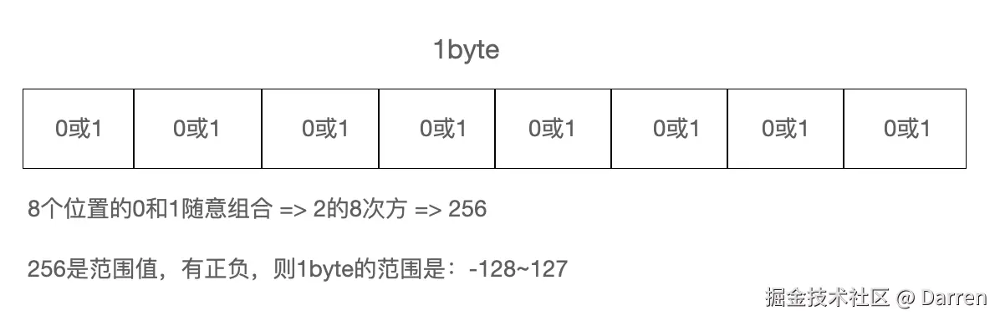
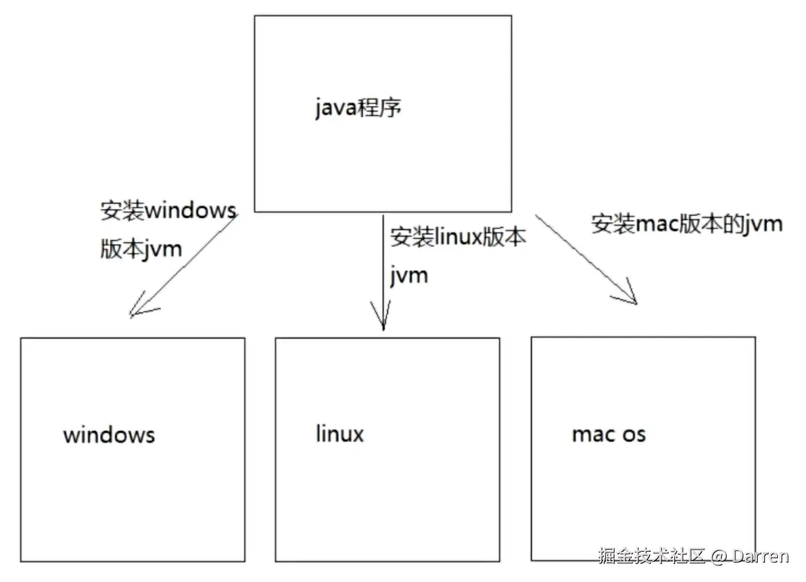
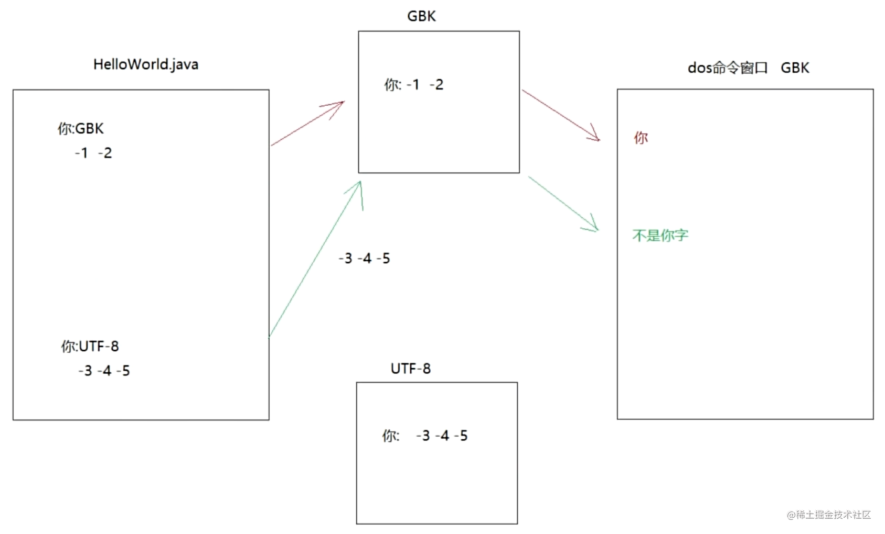

# 1 前言

## 1.1 字节

字节是计算机中最小的计量单位，通常用 `byte` 或 `B` 来表示。

另外，计算机中最小的存储单元是二进制，我们在计算机中看到的任何元素都是通过 CPU 转换二进制而来。**二进制用bit表示。**

1个字节=8个二进制



一般，存储数据的计量单位换算如下：

* 8bit = 1B
* 1024B = 1KB
* 1024KB = 1MB
* 1024MB = 1GB
* 1024GB = 1TB
* ......

## 1.2 常用的 dos 命令

在现在的可视化操作界面出来之前，普遍都是通过命令行来操作文件或文件夹。

这些命令需要在命令行窗口中运行。

### 1.2.1 如何打开命令行窗口（黑窗口）？

#### (1) window 环境

* 方式1：按住 `win+r`，在打开的对话框中输入 `cmd`，按回车键；
* 方式2：在需要打开命令行窗口的文件夹路径上直接输入 `cmd`，接着按回车键。

#### (2) mac 环境

安装 iterm，具体安装和使用步骤，可网上搜索对应教程。

### 1.2.2 常见的 dos 命令

|  序号 | 名称             | 具体操作命令                               |
| :-: | -------------- | ------------------------------------ |
|  1  | 切换盘符           | 输入 `D:` 或 `d:`（不用区分大小写）来进入当前电脑拥有的盘符     |
|  2  | 进入下一个文件夹       | 输入 `cd 文件夹名称`                         |
|  3  | 进入多层级文件夹       | 输入 `cd 文件夹名称\文件夹名称\.....`             |
|  4  | 返回上一层          | 输入 `cd ..`                            |
|  5  | 返回当前盘符根目录      | 输入 `cd \`                             |
|  6  | 查看当前路径下的文件或文件夹 | 输入 `dir`                              |
|  7  | 清除命令行窗口界面      | 输入 `cls`                              |
|  8  | 退出命令行窗口        | 输入 `exit`                             |
|  9  | 在当前路径下创建文件夹    | 输入 `mkdir 文件夹名称`                      |
|  10 | 在当前路径下创建嵌套文件夹  | 输入 `mkdir 文件夹名称\文件夹名称\......`         |
|  11 | 在当前路径下删除某个文件夹  | 输入 `rd 文件夹名`。注意：文件夹必须为空，删除的文件夹不会去到回收站 |
|  12 | 在当前路径下删除某个文件   | 输入 `del 文件名.后缀名`。注意：删除的文件不会去到回收站      |
|  13 | 删除某类文件         | 输入 `del *.后缀名`                        |

# 2 环境及安装

## 2.1 JVM 和跨平台

jvm（java virtual machine 的缩写）是运行 java 代码的虚拟计算机。

可根据不同操作系统来安装不同的 jvm（不同版本的 jvm 会将 java 代码编译成对应操作系统可识别的 java 代码，以达到编写一次 java 代码，就可以多端运行的目的，这也是所谓跨平台。



## 2.2 JDK 和 JRE

jdk（java development kit）全称为 java 开发工具包，包含了 jre，通过 jdk 可以运行以下命令：

* javac，编译工具；
* java，运行工具；
* jdb，调试工具；
* jhat，内存分析工具；
* ......

jre（java runtime environment）全称 java 运行环境，包含 jvm 以及后面用到的核心类库。

jdk、jre 以及 jvm 的关系：
jdk 包含 jre，而 jre 又包含了 jvm。所以，如果安装 java，只需安装 jdk 即可。

**注意：**
但从 jdk9 开始，jdk 目录中就没有包含 jre目录了，因为 jre 作为一个运行时，里面不需要包含太多内容，内容多意味着占用空间多，同时会降低运行效率。

因此，jdk9 引入了模块的技术，让开发者按照自己的应用来构建一个最小的运行时，这样会提高代码的运行效率。（比如：一个微服务的部署应用仅需一个非常小的运行时，而不是像以前不管应用复杂还是简单，都需要近百兆运行时）

## 2.3 下载安装

### 2.3.1 Mac 系统

这里下载以 Macbook M1 Pro 为例子（ M 系列就是 ADM 芯片，此外就是 Intel 系列了）。

* 先到 [oracle 官网](https://www.oracle.com/)；
* 点击顶部菜单 `资源` -> `Java下载` -> `macOS` -> `ARM64 DMG Installer`；
* 下载好安装程序之后，点击安装一键完成即可；
* 最后，通过 `javac` 和 `java` 命令就可以运行java文件了。

### 2.3.2 Window 系统

**注意：** Window 系统安装的时候，安装路径上不要有中文和空格，下载的版本为：Windows x64 Installer

如果是 Window 系统，一般为了方便，还是要自己配置下环境变量。

在 Window 系统下，安装了 Java 之后，安装程序会默认帮我配置一个 javapath的环境变量，一般我们为了以后方便修改不同的 Java 版本，都会先：

* 配置 `JAVA_HOME` 这个环境变量，这个变量值指向 Java 目录；
* 在系统变量的 `path` 中加入 `%JAVA_HOME%/bin`，意思是不管以后 Java 的版本怎么变，在使用 `javac` 和 `java` 命令时，都会在 `JAVA_HOME` 的 `bin` 目录中找寻对应的命令启动器。

## 2.4 配置环境变量

为了在任何目录下都能使用 `java` 和 `javac`，我们需要配置对应的环境变量（不配置环境变量则只能在 java/bin 目录的终端访问 `java` 和 `javac` 命令）。

配置环境变量有两种主要的方式：

* 直接在环境变量的 path 中添加 Java 目录下的 bin 路径，比如：E:java/bin（不推荐，这种方式创建的环境变量，后面如果要切换 Java 的版本，改起来路径有一定的风险，因为会不小心点到旁边的删除按钮，一旦 path 被删除，可能会造成系统一定的报错，path 里面有系统需要的一些环境变量）；
* 通过 `JAVA_HOME` 变量的形式来引用路径，比如：创建一个新的环境变量，让其指向 Java 的根目录。然后在 `path` 中引用这个变量，引用变量的时候要用 `%` 包裹变量，比如：引用 `JAVA_HOME`，就需要使用 `%JAVA_HOME%` 这种方式才能引用，然后 `%JAVA_HOME%` 后面可以跟着 `\bin` ，这是表示会到 `JAVA_HOME` 目录下的 `bin` 目录下去查找 `java` 和 `javac` 的运行程序（exe）

**注意：** jdk 安装之后，会自动在环境变量中添加 javaPath 环境变量，当我们配置了`JAVA_HOME`之后，javaPath 就可以删除了。

# 3 开发三步骤

## 3.1 编写

创建一个文本文档，随后把后缀名改成 `.java`，使其变成一个java文件。
**注意：** 修改后缀名的时候，要让后缀名显示出来，否则修改的可能是文件名。

## 3.2 编译

通过 `javac` 命令将 `.java` 文件编译生成一个 `.class` 文件（字节码文件）。（因为 jvm 只识 `.class` 文件）

## 3.3 运行

通过 `java` 命令运行 `.class` 文件，在运行的时候只需要带出文件名就行，`.class` 后缀不需要带出。
如果带出，则会出现报错 `错误: 找不到或无法加载主类 Demo01HelloWorld.class
原因: java.lang.ClassNotFoundException: Demo01HelloWorld.class`

# 4 编写Hello World

## 4.1 代码示例

Demo01HelloWorld.java

```java
public class Demo01HelloWorld {
    public static void main (String[] args) {
        System.out.println("Hello World!");
    }
}
```

## 4.2 关于示例代码的解释

* `public class Demo01HelloWorld` 是定义一个类；
* `class` 代表类的意思，类是 java 程序最基本的组成单元，所有 java 代码都需要在类中来写；
* `class` 后面跟的名字叫类名（类名要和 java 文件名保持一致）。
* `public static void main (String[] args)` 叫 main 方法，是程序的入口，jvm 执行代码，会从 main 方法开始执行；
* `System.out.println("Hello")` 是打印输出语句。

**注意：**

* 代码中 `class` 后的类名要和 `java` 文件名一致；
* 避免将 `main` 写成 `mian`；
* `System` 和 `main 的参数类型 String` 的首字母要大写；
* 每个单词写完要补充空格以增强代码可读性；
* 代码中的标点符号必须要是英文的，函数体每行的代码写完之后都要补上英文";"，否则在运行 `javac Demo01HelloWorld.java` 时，会报“需要添加";"”的错误；
* 花括号要一对一对地写。

## 4.3 字符编码出现的乱码问题

有时候我们会遇到在 `java` 文件里面打印中文，后面编译运行出来的却是乱码的问题。

遇到这种问题往往是我们字符编码的问题导致的，我们都知道：

* 编码的过程就是保存数据的过程；
* 解码的过程就是读取数据的过程。

我们常用的编码规范有：GBK（也是ANSI）、UTF-8，一个汉字在 `GBK` 中占2个字节，在 `UTF-8` 中占3个字节。

在 DOS 命令窗口中，中文的解码规范默认为 `GBK`。

当出现乱码时，就是编码和解码时用的编码规范不一致而导致，也就是你编码时用的是 `UTF-8`，但解码时用的却是 `GBK`（通过下图可以更直观看到其中的过程）。



## 4.4 关于 java 类名必须要跟文件名一致的问题

`java` 类名是一定要跟文件名保持一致吗？答案是否。

一个 `java` 文件可以有多个类，但是当一个 `class` 带上 `public` 的时候，那这个类就必须跟文件名保持一致，但一般建议一个 `java` 只写一个 `class`，而且这个 `class` 建议是 `public class`。

此外，`main` 方法也是必须写在 `public class` 里面的。

Demo01.java

```java
public class Demo01 {
    ...
}
class A {}
class B {}
```

像上面这个文件，会编译出三个 `class` 文件，分别是：Demo01.class、A.class、B.class，按照建议，Demo01.java 文件 只写一个 `public class Demo01` 就好。

## 4.5 println 和 print 的区别

`println` 和 `print` 的区别在于前者打印出来的字符具有换行效果，而后者打印出来的字符不具有换行效果。

```java
public class Demo02 {
    public static void main (String[] args) {
        /**
            System.out.println 可以换行，最终打印出来的是：
            床前明月光
            疑是地上霜
        */
        // System.out.println("床前明月光");
        // System.out.println("疑是地上霜");

        /**
            System.out.print 不能换行，最终打印出来的是：
            床前明月光疑是地上霜
        */
        System.out.print("床前明月光");
        System.out.print("疑是地上霜");
    }
}
```

# 5 注释

## 5.1 单行注释

```java
// XXX
```

## 5.2 多行注释

```java
/* XXX */
```

## 5.3 文档注释

```java
/** 
  XXX
*/
```

文档注释可以通过以下命令来自动生成一个文档说明：

```c
javadoc -d 生成的文件夹名字 -author -version 要生成文档的java文件（文件名.java）
```

\*\*注意：\*\*只有文档注释才能在 `javadoc` 中生成。

## 5.4 例子

Demo01HelloWorld.java

包含：单行注释、多行注释和文档注释

```java
// 单行注释。class关键字后面的名字要和java文件名一致。
public class Demo01HelloWorld {
    /*
    main是一个方法，是程序的入口，jvm运行程序需要找到main入口。
    */
    public static void main (String[] args) {
        /**
         * 这里是文档注释
         */
        System.out.println("Hello World!");
    }
}
```

# 6 关键字

和 `js` 一样，`java` 也会有它的关键字。

所谓 `java` 关键字，就是指 `java` 提前定好的，具有特殊含义的小写单词。

一般关键字在代码编辑器中都会以特别的颜色高亮，如下：在 `Notepad++` 中打开一个 `java` 文件，关键字（`public`、`class`、`static`、`void`）会高亮。


<table align="center" border="1">
    <thead align="center">
        <tr>
            <th colspan="6" align="center">Java 常见关键字</th>
        </tr>
    </thead>
    <tbody>
        <tr>
            <td align="center">abstract</td>
            <td align="center">assert</td>
            <td align="center">boolean</td>
            <td align="center">break</td>
            <td align="center">byte</td>
            <td align="center">case</td>
        </tr>
        <tr>
            <td align="center">catch</td>
            <td align="center">char</td>
            <td align="center">class</td>
            <td align="center">const</td>
            <td align="center">continue</td>
            <td align="center">default</td>
        </tr>
        <tr>
            <td align="center">do</td>
            <td align="center">double</td>
            <td align="center">else</td>
            <td align="center">enum</td>
            <td align="center">extends</td>
            <td align="center">final</td>
        </tr>
        <tr>
            <td align="center">finally</td>
            <td align="center">float</td>
            <td align="center">for</td>
            <td align="center">goto</td>
            <td align="center">if</td>
            <td align="center">implements</td>
        </tr>
        <tr>
            <td align="center">import</td>
            <td align="center">instanceof</td>
            <td align="center">int</td>
            <td align="center">interface</td>
            <td align="center">long</td>
            <td align="center">native</td>
        </tr>
        <tr>
            <td align="center">new</td>
            <td align="center">package</td>
            <td align="center">private</td>
            <td align="center">protected</td>
            <td align="center">public</td>
            <td align="center">return</td>
        </tr>
        <tr>
            <td align="center">strictfp</td>
            <td align="center">short</td>
            <td align="center">static</td>
            <td align="center">super</td>
            <td align="center">switch</td>
            <td align="center">synchronized</td>
        </tr>
        <tr>
            <td align="center">this</td>
            <td align="center">throw</td>
            <td align="center">throws</td>
            <td align="center">transient</td>
            <td align="center">try</td>
            <td align="center">void</td>
        </tr>
         <tr>
            <td align="center">volatile</td>
            <td align="center">while</td>
        </tr>
    </tbody>
</table>
