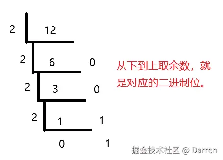
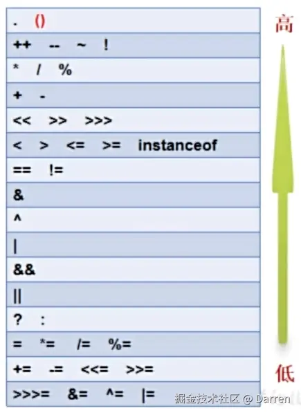

# 1 常量

**常量**：就是在代码的运行过程中，值不会发生改变的数据。

## 1.1 常量的分类

常量分为：整数、小数、字符、字符串、布尔、空。

### 1.1.1 整数常量

整数常量包含所有整数。

### 1.1.2 小数常量

所有带小数点的常量都可以称为小数常量：比如：1.5、2.0。

**注意：** 2.0 因为带有小数点，所以也是小数常量。

### 1.1.3 字符常量

带单引号 `''` 的常量，且单引号中必须有且只能有一个内容，比如：

- 属于字符常量的案例：`'1'`、`' '`（有一个空格也算字符）、`'按一次 tab 键'`（一次 tab 键产生的效果也是常量）；
- 不属于字符常量的案例：`'11'`、`'a1'`、`  `（两个空格），内容超过一个以上都不算字符常量

### 1.1.4 字符串常量

带双引号 `""` 的常量，字符串常量中的内容随意填写。

### 1.1.5 布尔常量

布尔常量只有两种：`true`、`false`。

**注意：** 布尔常量不需要加双引号，加了双引号的 `"true"`、`"false"` 属于字符串常量，而不属于布尔常量。

### 1.1.6 空常量

空常量为：`null`，其代表的意思是数据不存在。

**注意：** `null` 和 `""` 其实不是同个意思，`null` 的意思，表示数据不存在，而 `""` 表示的是空字符串，但这个数据是存在的，只是字符内容为空。

## 1.2 常量的使用

```java
public class Demo03Constant {
    public static void main (String[] args) {
        // 整数常量
        System.out.println(1);
        System.out.println(-1);

        // 小数常量
        System.out.println(1.5);
        System.out.println(2.0);

        // 字符常量
        System.out.println(' ');
        System.out.println('a');
        System.out.println('	'); // 这个是一个 tab 键
        // System.out.println('    ');  // 字符常量只能有一个内容，这里4个空格内容会导致编译报错。

        // 字符串常量
        System.out.println("lang");
        System.out.println("123");

        // 布尔常量
        System.out.println(true);
        System.out.println(false);

        // 空常量 - 一般不能直接使用，至于怎么使用，后面继续学习
        // System.out.println(null);
    }
}

/**
    打印结果：
    1
    -1
    1.5
    2.0
     
    a

    lang
    123
    true
    false
*/
```

## 1.3 常量之间的运算

常量之间的运算，其实就是加减乘除。

**注意：** 在加减乘除的时候，如果相乘或相除的双方都是整数，尽管实际结果会有小数（一般是除法的时候），但最终打印显示的是整数。相反，只要任意一方有小数位，那结果都是包含小数位的。

```java
public class Demo04Constant {
    public static void main (String[] args) {
        // 加
        System.out.println(1+1);
        System.out.println(2.1+3);

        // 减
        System.out.println(5-1);
        System.out.println(10.5-2);

        // 乘
        System.out.println(2*3);
        System.out.println(2.0*3);

        // 除
        System.out.println(10/3);
        System.out.println(10.0/3);
    }
}

/**
    打印结果：
    2
    5.1
    4
    8.5
    6
    6.0
    3
    3.3333333333333335
*/
```

# 2 变量

**变量：** 就是在代码运行过程中，值会随着不同的情况而随时发生改变的数据。

## 2.1 变量的数据类型

变量的数据类型分为基本数据类型和引用数据类型：

* 基本数据类型，有 4 类 8 种：
    *   整型：`byte`、`short`、`int`、`long`；
    *   浮点型：`float`、`double`；
    *   字符型：`char`；
    *   布尔型：`boolean`
* 引用数据类型，有 5 种：
    *   类
    *   数组
    *   接口
    *   枚举
    *   注解

<table align="center" border="1">
    <thead align="center">
        <tr>
            <th colspan="4" align="center">基本数据类型</th>
        </tr>
        <tr>
            <th align="center">数据类型</th>
            <th align="center">关键字</th>
            <th align="center">内存占用</th>
            <th>取值范围</th>
        </tr>
    </thead>
    <tbody>
        <tr>
            <td align="center">字节型</td>
            <td align="center">byte</td>
            <td align="center">1个字节</td>
            <td>-128 至 127，当超出范围时报错</td>
        </tr>
        <tr>
            <td align="center">短整型</td>
            <td align="center">short</td>
            <td align="center">2个字节</td>
            <td>-32768 至 32767</td>
        </tr>
        <tr>
            <td align="center">整型</td>
            <td align="center">int</td>
            <td align="center">4个字节</td>
            <td>-2147483648 至 2147483647，正负21个亿</td>
        </tr>
        <tr>
            <td align="center">长整型</td>
            <td align="center">long</td>
            <td align="center">8个字节</td>
            <td>-9223372036854775808 至 9223372036854775807，19位数字</td>
        </tr>
        <tr>
            <td align="center">单精度浮点数</td>
            <td align="center">float</td>
            <td align="center">4个字节</td>
            <td>1.4013^10*-45 至 3.4028^10*38</td>
        </tr>
        <tr>
            <td align="center">双精度浮点数</td>
            <td align="center">double</td>
            <td align="center">8个字节</td>
            <td>4.9^10*-324 至 1.7977^10*308</td>
        </tr>
        <tr>
            <td align="center">字符型</td>
            <td align="center">char</td>
            <td align="center">2个字节</td>
            <td>0 至 2^16^-1</td>
        </tr>
        <tr>
            <td align="center">布尔类型</td>
            <td align="center">boolean</td>
            <td align="center">1个字节</td>
            <td>true，false（可以做判断条件使用）</td>
        </tr>
    </tbody>
</table>

## 2.2 变量的定义

### 2.2.1 定义单个变量 - 方式1

声明变量，同时赋值。数据类型 变量名 = 值;

如：`int num = 1;`

### 2.2.2 定义单个变量 - 方式2

先声明变量，再赋值。

数据类型 变量名;

变量名 = 值;

如:

```java
int num;
num = 1;
```

### 2.2.3 定义多个同类型变量 - 方式1

先声明变量，再赋值。

数据类型 变量名1, 变量名2, 变量名3;

变量名1 = 值;

变量名2 = 值;

变量名3 = 值;

如:

```java
int num1, num2, num3;
num1 = 1;
num2 = 2;
num3 = 3;
```

### 2.2.4 定义多个同类型变量 - 方式2

声明变量，同时赋值。

数据类型 变量名1 = 值, 变量名2 = 值, 变量名3 = 值;

如: `int num1 = 1, num2 = 2, num3 = 3; `

### 2.2.5 关于变量赋值的读法

先看等号右边的值，再看等号左边的变量类型（本质操作过程是把等号右边的数据赋值给等号左边的变量），当右边有运算时，需要等运算结果出来再进行赋值。

### 2.2.6 关于字符串的类型

字符串不属于 `基本数据类型`，而是属于 `引用数据类型`，用 `String` 表示，`String` 是一个类，所以字符串其实是引用数据类型中的一个类，只是在定义的时候可以和基本数据类型格式一样（直接赋值）。

## 2.3 变量的使用

### 2.3.1 变量的赋值

```java
public class Demo05Var {
    public static void main (String[] args) {
        // byte，注意 byte 的范围是 -128 到 127，超出范围会报错
        byte num1 = 127;
        num1 = 120;
        System.out.println(num1);

        // short
        short num2 = 100;
        num2 = 101;
        System.out.println(num2);

        // int，整数的默认类型
        int num3 = 1000;
        num3 = 1001;
        System.out.println(num3);

        // long，定义long型的变量后面建议加个L
        long num4 = 10L;
        System.out.println(num4);

        // float，定义float型的变量后面建议加个F
        float num5 = 2.5F;
        System.out.println(num5);

        // double，小数的默认类型
        double num6 = 2.5;
        System.out.println(num6);

        // char
        char num7 = 'A';
        System.out.println(num7);

        // boolean
        boolean num8 = true;
        boolean num9 = false;
        num8 = num9;
        System.out.println(num8);

        // String，字符串其实是引用数据类型类的一种，只是定义方式跟基本类型一样。
        String name = "海贼王";
        System.out.println(name);
    }
}

/**
    打印结果：
    120
    101
    1001
    10
    2.5
    2.5
    A
    false
    海贼王
*/
```

### 2.3.1 变量的加减乘除

```java
public class Demo06Var {
    public static void main (String[] args) {
        int num1 = 10;
        int num2 = 3;

        // 变量的加法
        int num3 = num1 + num2;
        System.out.println(num3);

        // 变量的减法
        int num4 = num1 - num2;
        System.out.println(num4);

        // 变量的乘法
        int num5 = num1 * num2;
        System.out.println(num5);

        // 变量的除法
        int num6 = num1 / num2;
        System.out.println(num6); // 两个整型相除之后，尽管实际结果是小数，但得出的结果会取整数部分。

        // double，会取小数点位
        double num7 = num1 / num2;
        System.out.println(num7);
    }
}

/**
    打印结果：
    13
    7
    30
    3
    3.0
*/
```

## 2.4 转义字符

转义字符可以将普通字符转成具有特殊含义的字符，也能将具有特殊含义的字符转成普通字符，其标识符号为：`\`。

```java
public class Demo07Var {
    public static void main (String[] args) {
        // \n，表示换行符
        System.out.print("床前明月光\n");
        System.out.print("疑是地上霜\n");

        // \t，表示制表符，也就是Tab键
        System.out.println("1\t2\t3");

        // \\，表示打印 \ 字符
        System.out.println("C:\\Users\\games");
    }
}

/**
    打印结果：
    床前明月光
    疑是地上霜
    1       2       3
    C:\Users\games
*/
```

## 2.5 float 和 double 的区别

`float` 的小数位只有 23 位二进制，能表示的最大十进制为 2 的 23 次方（8388608，是7位数），所以float型数据代表的小数位是 7。

`double` 的小数位只有 52 位二进制，能表示的最大十进制为`4 503 599 627 370 496`，是 16 位数，所以 double 型代表的小数位是 16。

**注意：** 将来开发的时候，尽量不要用 float 或者 double 直接参与运算，因为直接参与运算会有精度损失问题。

```java
public class Demo08Var {
    public static void main (String[] args) {
        float num1 = 10;
        float num2 = 3;
        System.out.println(num1 / num2);

        double num3 = 10.213;
        double num4 = 3.113;
        System.out.println(num3 / num4);
        System.out.println(num3 - num4);

        float num5 = 3.55F;
        float num6 = 2.12F;
        System.out.println(num5 - num6); // 直接用float进行运算会有精度损失问题。
    }
}

/**
    打印结果：
    3.3333333
    3.2807581111468034
    7.1
    1.4300001
*/
```

## 2.6 变量使用时的注意事项

*   变量未初始化（首次赋值）之前，不能使用；

```java
public class Demo09Var {
    public static void main (String[] args) {
        int num;
        // num = 10; // 初始化之后，再使用则不会报错。
        System.out.println(num);
    }
}

/**
    打印结果：
    Demo09Var.java:5: 错误: 可能尚未初始化变量num
    System.out.println(num);
                        ^
    1 个错误
*/
```

*   在同一个作用域中（一对花括号），不能定义重复的变量；

```java
public class Demo10Var {
    public static void main (String[] args) {
        int num = 10;
        int num = 20;
        System.out.println(num);
    }
}

/**
    打印结果：
    Demo10Var.java:4: 错误: 已在方法 main(String[])中定义了变量 num
                    int num = 20;
                        ^
    1 个错误
*/
```

*   不同作用域中的数据尽量不要随意访问，小作用域可以访问大作用域中的变量，但是大作用域不能访问小作用域中的变量。

```java
public class Demo11Var {
    public static void main (String[] args) {
        int num = 10;

        {
                int num2 = 20;
                System.out.println(num); // 小作用域能访问外部大作用域的变量
        }

        System.out.println(num2); // 大作用域不能访问内部小作用域的变量
    }
}

/**
    打印结果：
    Demo11Var.java:10: 错误: 找不到符号
                    System.out.println(num2); // 大作用域不能访问内部小作用域的变量
                                       ^
      符号:   变量 num2
      位置: 类 Demo11Var
    1 个错误
*/
```

## 2.6 变量的练习

```java
public class Demo12VarPerson {
    public static void main (String[] args) {
        String name = "张三";
        char sex = '男';
        int year = 18;
        double height = 181.1;
        double weight = 180.5;

        System.out.println(name);
        System.out.println(sex);
        System.out.println(year);
        System.out.println(height);
        System.out.println(weight);
    }
}

/**
    张三
    男
    18
    181.1
    180.5
*/
```

## 2.5 标识符

标识符就是给类、方法、常/变量等取的名字。

### 硬性规定

*   可以包含 `英文字母`（大小写）、`数字`、`$` 和 `_`；
*   不能以数字开头，如：`int 2t = 100`，这是错误的；
*   不能是关键字，如：`int public = 100`，这也是错误的。

### 软性建议

*   给类取名，遵循大驼峰；
*   给方法和变量取名，遵循小驼峰；
*   命名要语义化。

# 3 数据类型转换

*   关于数据类型转换的触发时机：
    *   等号左右两边的数据类型不一致；
    *   不同数据类型的数据进行运算；
*   关于类型转换的分类：
    *   自动类型转换。
    *   强制类型转换
*   基本类型中，按照取值范围从小到大的排序：
    *   byte, short, char -> int -> long -> float -> double

## 3.1 自动类型转换

*   将取值范围小的数据类型赋值给取值范围大的数据类型 -> 小自动转大
*   将取值范围小的数据类型和取值范围大的数据类型做运算 -> 小自动转大

### 赋值和运算引起的自动类型转换

```java
public class Demo01 {
    public static void main (String[] args) {
        /*
            等号右边是整数 int 类型，左边是 long 类型
            这里因为 int 的取值范围小于 long，int 会自动转成 long 类型
        */
        long num = 100;
        System.out.println(num);

        /*
            + 左边是 int 类型，右边是 double 类型
            相加时，int 会自动转成 double 类型
        */
        int num1 = 10;
        double num2 = 2.5;
        double sum = num1 + num2;
        System.out.println(sum);
    }
}

/**
    100
    12.5
*/
```

## 3.2 强制类型转换

将取值范围大的数据类型赋值给取值范围小的数据类型 -> 需要强转

```java
public class Demo02 {
    public static void main (String[] args) {
        /*
            等号右边的 2.5 默认是 double 类型，左边是 float 类型
            要将 double 类型赋值给 float 类型，需要将 double 类型转成 float 类型，才能赋值。否则会报错
            转换方式：(float)2.5 或者 2.5F
        */
        
        // flout num = 2.5;  // 会报错，因为 2.5 默认是 double 类型
        float num = 2.5F;
        float num1 = (float)2.5;
        System.out.println(num);
        System.out.println(num1);
    }
}
/**
    2.5
    2.5
*/
```

## 3.3 强转的注意事项

### 3.3.1 强转造成的精度损失和数据溢出现象

一般情况下，不要随意写强转格式的代码，因为强转数据对于 `浮点数` 和 `长整型` 会有精度损失和数据溢出的问题，除非没有办法。

*   强转数据对 `浮点数` 的影响（精度缺失）：

```java
public class Demo03 {
    public static void main (String[] args) {
        // 最终打印出2，小数位精度损失
        int num = (int)2.5;
        System.out.println(num);
    }
}
/**
    2
*/
```

*   强转数据对 `长整型` 的影响（数据溢出）：

```java
public class Demo04 {
    public static void main (String[] args) {
        // 100 亿对于 int 数据来说太大了，int 类型的数据最大只能到 1410065408
        // int 类型占内存 4 个字节，4 个字节对应 32 位二进制，而 100 亿是34位二进制，所以多出的 2 位二进制会溢出。
        // 100 亿转成二进制是： 10 0101 0100 0000 1011 1110 0100 0000 0000，前面两位溢出掉，剩下的是：101 0100 0000 1011 1110 0100 0000 0000
        // 最大的 int (1410065408) 转成二进制是：101 0100 0000 1011 1110 0100 0000 0000，刚好就是 100 亿溢出的前面两位二进制后，剩余的二进制数。
        int num = (int)10000000000L; 
        System.out.println(num);
    }
}
/**
    1410065408
*/
```

### 3.3.2 `byte`、`short` 和 `char` 强转时的注意点

*   `byte`、`short` 定义时如果等号右边是 `整数数字`，这个 `整数数字` 在不超过 byte、short 范围的前提下，jvm 会对它进行自动类型转换，不需要我们手动去转换；

```java
public class Demo05 {
    public static void main (String[] args) {
        // 10 默认是 int 类型，因为 10 属于 byte 的范围，且是直接的数字数据，jvm 会自动帮我们将 10 转成 byte 类型。 
        byte num = 10; 
        System.out.println(num);
    }
}
/**
    10
*/
```

*   当 `byte`、`short` 的等号右边有变量参与时，变量如果是 `byte` 和 `short` 类型，它们会被自动提升为 `int` 类型（在 Java 中，当进行算术操作时，如果操作数的类型不同，**较小的类型会被提升为较大的类型**），所以我们还需要对运算之后的结果进行强转到对应类型后再赋值；

```java
public class Demo06 {
    public static void main (String[] args) {
        // 10 默认是 int 类型，因为 10 属于 byte 的范围，且是直接的数字数据，jvm 会自动帮我们将 10 转成 byte 类型，不需要我们手动强转。
        // num + 1 时，num 是 byte 类型，会被自动提升为 int 类型，所以最后，我们需要对运算结果进行强转，再进行赋值。
        byte num = 10;
        num = (byte)(num + 1);
        System.out.println(num);
    }
}
/**
    11
*/
```

*   `char` 类型数据如果参与运算，会自动提升为 `int` 类型。整个过程是 `char` 会根据数据字符去 `ASCII` 码表（美国标准交换代码）中去匹配对应的 `int` 值，如果在这里没找到，会接着去 `unicode` 码表中寻找。

```java
public class Demo07 {
    public static void main (String[] args) {
        // a 对应的数字是从 ASCII 码表中查询到的对应数字，而 "中" 是从 unicode 码表中查询对应的数字。
        // a = 97
        // 中 = 20013
        char num1 = 'a';
        int num2 = num1 + 1;
        char num3 = '中';
        int num4 = num3 + 1; 
        System.out.println(num2);
        System.out.println(num4);
    }
}
/**
    98
    20014
*/
```

### 3.3.3 `byte` 赋值超范围分析

```java
public class Demo08 {
    public static void main (String[] args) {
        // 对于超出 byte 范围的数，需要手动强转
        // 方式1：通过原码、反码、补码来计算超出 byte 范围的数
        // 200的原码为：1100 1000
        // 200的反码为（对原码取首位不变，其余取反）：1011 0111
        // 200的补码为（对反码取首位为正负，然后+1）：1011 1000，首位 1 对应负号，所以就是 -111000，其对应的十进制就是 -56
        byte b1 = (byte)200;
        System.out.println(b1);

        // 方式2：通过从 -128~127 从头循环来计算出超出 byte 范围的数。
        // 128 比 byte 最大的 127 还多一位，所以从范围的头开始计算一位，也就是 -128，以此类推，int 200 强转成 byte，也是 -56
        byte b2 = (byte)128;
        System.out.println(b2);
    }
}
/**
    -56
    -128
*/
```

# 4 进制转换

## 4.1 二进制和十进制

### 4.1.1 十进制转成二进制

一般十进制转成二进制，采用辗转相除法，即：拿一个十进制数循环除以 2，然后取余数（从下到是上取）。

**注意：** 最后有余数 1 的时候，会用 1 / 2 = 0.5 取 0 整数。因为十进制转二进制的“除二取余法”中，只看商的整数部分，不管小数部分。

比如：12 对应的二进制是 1100

计算过程如下：



### 4.1.2 二进制转成十进制

对于二进制转成十进制，一般是使用 8421 规则来进行计算。

#### 8421 规则，就是：

1.  按照二进制的位数来定义位数个 2 的 位数-1 次幂；
2.  然后将得出的结果和对应的二进制位数相乘；
3.  最后将结果相加。

#### 具体计算过程如下：

假设我们现在有一个二进制数：110 1001，那么这个二进制数的位数为 7 位，每位的权重如下：

*   第 1 位（最右边）权重是 2^0 = 1
*   第 2 位权重是 2^1 = 2
*   第 3 位权重是 2^2 = 4
*   第 4 位权重是 2^3 = 8
*   第 5 位权重是 2^4 = 16
*   第 6 位权重是 2^5 = 32
*   第 7 位（最左边）权重是 2^6 = 64

逐位计算：

*   第 1 位是 1，对应权重是 1，计算 1 × 1 = 1
*   第 2 位是 0，对应权重是 2，计算 0 × 2 = 0
*   第 3 位是 0，对应权重是 4，计算 0 × 4 = 0
*   第 4 位是 1，对应权重是 8，计算 1 × 8 = 8
*   第 5 位是 0，对应权重是 16，计算 0 × 16 = 0
*   第 6 位是 1，对应权重是 32，计算 1 × 32 = 32
*   第 7 位是 1，对应权重是 64，计算 1 × 64 = 64

将所有结果相加：

64 + 32 + 0 + 8 + 0 + 0 + 1 = 105

## 4.2 二进制和八进制

二进制转八进制的时候，需要将二进制数分开（分开的时候，3个二进制数为一组）

示例如下：

假设有二进制数为 110011，现将它每三个分为一组：则为 110 011，然后分组计算：

*   110 -> 1 \* 2^2 + 1 \* 2^1 + 0 \* 2^0 = 6
*   011 -> 0 \* 2^2 + 1 \* 2^1 + 1 \* 2^0 = 3

最后将分组计算出来的值拼接（这里是6和3拼接），就是该二进制数对应的八进制数了。

所以， `110011` 对应的八进制数为 `63`。

## 4.3 二进制和十六进制

二进制转十六进制的时候，需要将二进制数分开（分开的时候，4个二进制数为一组）

示例如下：

假设有二进制数为 10011011，现将它每四个分为一组：则为 1001 1011，然后分组计算：

1001 -> 1 \* 2^3 + 0 \* 2^2 + 0 \* 2^1 + 1 \* 2^0 = 9

1011 -> 1 \* 2^3 + 0 \* 2^2 + 1 \* 2^1 + 1 \* 2^0 = 11

11 在十六进制中，表示 b（十六进制 9 之后就是 a、b、c、d、e、f）。

最后将分组计算出来的值拼接（这里是 9 和 b 拼接），就是该二进制数对应的十六进制数了。

所以， `10011011` 对应的十六进制数为 `9b`。

## 4.4 总结

二进制转十进制：
1. 得出二进制的位数
2. 求得每个位数的 2 的(位数 - 1)次方 的值 x
3. 每位二进制数 * x
4. 将各个位的数值相加求和

二进制转八进制或十六进制：
1. 将二进制以三位（八进制）或四位（十六进制）为一组进行分组（按从左到右）
2. 每一组求出每位二进制数 * 2的（分组后的二进制数的当前位数 - 1）次方的值，然后相加
3. 将各组求出来的数字进行字符拼接

# 5 位运算

## 5.1 常识介绍

*   符号的介绍：
    *   &（与）-> 有假则假；
    *   |（或）-> 有真则真；
    *   \~（非）-> 取反；
    *   ^（异或）-> 符号前后结果一致则为 false，否则为 ture。
*   1 代表 true，0 代表 false
*   计算机都是用存储数据的 `补码` 进行存储，计算也是。而我们在电脑看到的数据则为原码，原码的正数和补码一样，负数原码则是经过电脑对补码数据的转换之后，才显示为负数原码的。
*   正数二进制最高位为 0，负数二进制最高位为 1
*   正数的 `原码`、`反码`、`补码` 一致，负数的 `原码`、`反码`、`补码` 不一样，需要采取对应的规则进行处理（如：反码取原码首位不变，其余取反；补码取反码首位为正负，然后 +1）。

## 5.2 左移 `<<`

快速算法：左移几位就等于乘以 2 的几次方。

**注意：** 当左移的位数 n 超过该数据类型的总位数时，相当于左移（n - 总位数）位（比如：一个数据类型是 8 位，左移了 10 位，则相当于左移了 10 - 8 = 2 位）。

### 5.2.1 正数的左移

示例如下：

2 << 2

通过快速算法：2 \* 2^2 可得出结果等于 8。

此外，还有二进制算法：

2 转成二进制为：`0000 0000 0000 0000 0000 0000 0000 0010` -> 然后左移两位 `0000 0000 0000 0000 0000 0000 0000 10` -> 再补零，得出 `0000 0000 0000 0000 0000 0000 0000 1000` -> 然后转成十进制，就是 8。

### 5.2.2 负数的左移

示例如下：

\-2 << 2

通过快速算法：-2 \* 2^2 可得出结果等于 -8。

此外，还有二进制算法：

2 转成二进制为：`1000 0000 0000 0000 0000 0000 0000 0010` -> 将原码转成反码 `1111 1111 1111 1111 1111 1111 1111 1101` -> 在反码基础上首位不变，再 +1 得出补码 `1111 1111 1111 1111 1111 1111 1111 1110` -> 将补码左移 2 位，再补零，得出 `1111 1111 1111 1111 1111 1111 1111 1000` -> 将补码转成反码，在补码的基础上 -1，得出 `1111 1111 1111 1111 1111 1111 1111 0111` -> 将反码转成原码，得出 `1000 0000 0000 0000 0000 0000 0000 1000`，结果就是 -8。

## 5.3 右移 `>>`

快速算法：右移几位就等于除以 2 的几次方，如果不能整除，则向下取整。

### 5.3.1 正数的右移

示例如下：

9 >> 2

通过快速算法：9 / 2^2 可得出结果等于 2.25，向下取整得出 2。

此外，还有二进制算法：

9 转成二进制为：`0000 0000 0000 0000 0000 0000 0000 1001` -> 然后右移两位 `0000 0000 0000 0000 0000 0000 0000 10` -> 再补零，得出 `0000 0000 0000 0000 0000 0000 0000 0010` -> 然后转成十进制，就是 2。

### 5.3.2 负数的右移

示例如下：

\-9 >> 2

通过快速算法：-9 / 2^2 可得出结果等于 -2.25，向下取整得出 -3。

此外，还有二进制算法：

\-9 转成二进制为：`1000 0000 0000 0000 0000 0000 0000 1001` -> 将原码转成反码 `1111 1111 1111 1111 1111 1111 1111 0110` -> 在反码基础上首位不变，再 +1 得出补码 `1111 1111 1111 1111 1111 1111 1111 0111` -> 将补码右移 2 位，再补一（**注意：** 负数补一而不是零），得出 `1111 1111 1111 1111 1111 1111 1111 1101` -> 将补码转成反码，在补码的基础上 -1，得出  `1111 1111 1111 1111 1111 1111 1111 1100` -> 将反码转成原码，得出 `1000 0000 0000 0000 0000 0000 0000 0011`，结果就是 -3。

## 5.4 无符号右移 `>>>`

运算规则：往右移动后，左边空出来的位直接补 0，不管最高位是 0 还是 1，空出来的位都用 0 来补。

### 5.4.1 正数的无符号右移

运算规则和正数的右移一样（参考正数的右移的相关计算方式）。

9 >>> 2 = 2

### 5.4.1 负数的无符号右移

运算规则：右移出去几位，左边就补几个 0，结果变为正数。

\-9 >>> 2 = 2

\-9 转成二进制为：`1000 0000 0000 0000 0000 0000 0000 1001` -> 将原码转成反码 `1111 1111 1111 1111 1111 1111 1111 0110` -> 在反码基础上首位不变，再 +1 得出补码 `1111 1111 1111 1111 1111 1111 1111 0111` -> 将补码右移 2 位，再补零（**注意：** 无符号右移是补零，而不是补一），得出 `0011 1111 1111 1111 1111 1111 1111 1101` -> 将补码转成反码，在补码的基础上 -1，得出  `0011 1111 1111 1111 1111 1111 1111 1100` -> 将反码转成原码，得出 `0100 0000 0000 0000 0000 0000 0000 0011`，结果就是 1073741827。

**注意：**

*   对于一些二进制，在 32 位系统中，`>>>` 32 位，相当于右移 0 位，所以结果还是原来的值；
*   而如果是 `>>>` 34 位，则相当于右移了 2 位。

## 5.5 位运算符

在这部分的学习中，因为涉及位运算符和二进制位之间的运算，可以将 `true` 看作 `1`，`false` 看作 `0`。

### 5.5.1 按位与 `&`

运算规则：对应的位都是 1 才为 1，也就是说符号左右两边都为 `true`，结果才为 `true`。

*   1 & 1 结果为 1；
*   1 & 0 结果为 0；
*   0 & 1 结果为 0；
*   0 & 0 结果为 0。

运算示例，5 & 3，结果为 1，运算过程如下：

0000 0000 0000 0000 0000 0000 0000 0101 -> 5 的二进制

&

0000 0000 0000 0000 0000 0000 0000 0011 -> 3 的二进制
————————————————————
0000 0000 0000 0000 0000 0000 0000 0001 -> 结果为 1

**详解：**
- 右边第 1 位，5 和 3 都是 1，所以结果是 1 & 1 是 1
- 右边第 2 位，5 是 0， 3 是 1，结果是 0 & 1 是 0 
- 右边第 3 位，5 是 1， 3 是 0，结果是 1 & 0 是 0 

### 5.5.2 按位或 `|`

运算规则：对应的位只要有一个为 1 即为 1，也就是说符号左右两边有一个为 `true`，结果就为 `true`。

*   1 | 1 结果为 1；
*   1 | 0 结果为 1；
*   0 | 1 结果为 1；
*   0 | 0 结果为 0。

运算示例，5 | 3，结果为 7，运算过程如下：

0000 0000 0000 0000 0000 0000 0000 0101 -> 5 的二进制

&

0000 0000 0000 0000 0000 0000 0000 0011 -> 3 的二进制
————————————————————
0000 0000 0000 0000 0000 0000 0000 0111 -> 结果为 7

**详解：**
- 右边第 1 位，5 和 3 都是 1，所以结果是 1 | 1 是 1
- 右边第 2 位，5 是 0， 3 是 1，结果是 0 | 1 是 1 
- 右边第 3 位，5 是 1， 3 是 0，结果是 1 | 0 是 1 

### 5.5.3 按位异或 `^`

运算规则：对应的位两个都一样的为 0，否则为 1。

*   1 ^ 1 结果为 0；
*   1 ^ 0 结果为 1；
*   0 ^ 1 结果为 1；
*   0 ^ 0 结果为 0。

运算示例，5 ^ 3，结果为 6，运算过程如下：

0000 0000 0000 0000 0000 0000 0000 0101 -> 5 的二进制

&

0000 0000 0000 0000 0000 0000 0000 0011 -> 3 的二进制
————————————————————
0000 0000 0000 0000 0000 0000 0000 0110 -> 结果为 6

**详解：**
- 右边第 1 位，5 和 3 都是 1，所以结果是 1 ^ 1 是 0
- 右边第 2 位，5 是 0， 3 是 1，结果是 0 ^ 1 是 1 
- 右边第 3 位，5 是 1， 3 是 0，结果是 1 ^ 0 是 1 

### 5.5.4 按位取反 `~`

运算规则：`~` 会对每个二进制位进行取反操作，即将每一位的 `0` 变为 `1`，将 `1` 变为 `0`。当你对一个数字使用 `~` 运算符时，它会将该数字的所有二进制位取反。

运算示例，\~10 的结果为 -11，运算过程如下：

0000 0000 0000 0000 0000 0000 0000 1010 -> 10 的二进制补码（正数的原码、反码、补码都一样）
~
1111 1111 1111 1111 1111 1111 1111 0101 -> 10 的补码取反，得出取反后的补码
1111 1111 1111 1111 1111 1111 1111 0100 -> 将取反后的补码转成反码
1000 0000 0000 0000 0000 0000 0000 1011 -> 将算出的反码转成原码，结果为 -11

### 5.5.5 运算符的优先级



**注意：**

*   表达式不要太复杂；
*   优先计算 `()` 里面的。
