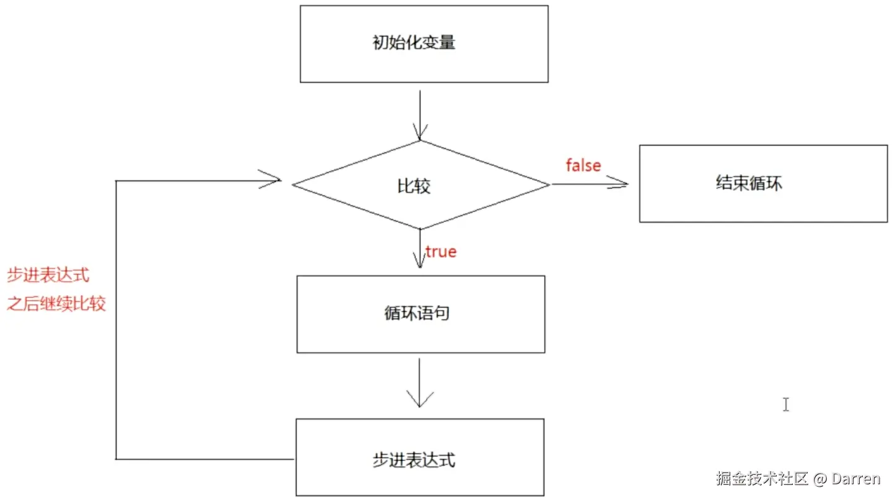

# 1 Scanner 键盘录入和 Random 随机数

## 1.1 Scanner 键盘录入

`Scanner` 是 Java 定义好的一个类，可以将你在终端中通过键盘输入的数据放到代码中参与运行，它位于 `java.util` 中。

使用方式：

*   导入 `Scanner` 类，`import java.util.Scanner;`；
*   创建 Scanner 对象，`Scanner 变量名 = new Scanner(System.in);`
*   调用 Scanner 对象下的方法，实现键盘数据录入：

    *   `变量名.nextInt()`，录入 int 类型数据；
    *   `变量名.next()`，录入 String 类型数据，遇到空格和回车就结束录入；

    ```java
    import java.util.Scanner;

    public class Demo01 {
        public static void main(String[] args) {
            Scanner sc = new Scanner(System.in);
            int data1 = sc.nextInt();
            System.out.println("data1 = " + data1);
            String data2 = sc.next();
            System.out.println("data2 = " + data2);
        }
    }

    /*
    键盘输入：11199
    data1 = 11199
    键盘输入：darren
    data2 = darren
    */
    ```

    ```java
    import java.util.Scanner;

    public class Demo03 {
        public static void main(String[] args) {
            Scanner sc = new Scanner(System.in);
            int res = sc.nextInt();
            System.out.println("nextInt空格后面的内容不会打印出来 ==" + res);
        }
    }

    /*
    键盘输入：1111 2222
    nextInt空格后面的内容不会打印出来 == 1111
    */
    ```

    ```java
    import java.util.Scanner;

    public class Demo04 {
        public static void main(String[] args) {
            Scanner sc = new Scanner(System.in);
            String str = sc.next();
            System.out.println("next空格后面的内容不会打印出来 == " + str);
        }
    }

    /*
    键盘输入：aaa bbb
    next空格后面的内容不会打印出来 == aaa
    */
    ```

    *   `变量名.nextLine()`，录入 String 类型数据，遇到回车才结束录入

    ```java
    import java.util.Scanner;

    public class Demo05 {
        public static void main(String[] args) {
            Scanner sc = new Scanner(System.in);
            String str = sc.nextLine();
            System.out.println("nextLine可以录入包含空格的数据 == " + str);
        }
    }

    /*
    键盘输入：aaa bbb
    nextLine可以录入包含空格的数据 == aaa bbb
    */
    ```

**注意：** 当你键盘输入的数据类型和一开始定义时不一样时，会报下面错误：

比如：`int res1 = sc.nextInt();`，但是键盘却输入 `String` 类型的数据。

    Exception in thread "main" java.util.InputMismatchException
    	at java.base/java.util.Scanner.throwFor(Scanner.java:964)
    	at java.base/java.util.Scanner.next(Scanner.java:1619)
    	at java.base/java.util.Scanner.nextInt(Scanner.java:2284)
    	at java.base/java.util.Scanner.nextInt(Scanner.java:2238)
    	at com.testing.flowcontrol.scannerandrandom.Demo03.main(Demo03.java:8)
    '

### 练习

*   求输入三个数中的最大值：

```java
public class Demo02 {
    public static void main(String[] args) {
        Scanner sc = new Scanner(System.in);
        int num1 = sc.nextInt(), num2 = sc.nextInt(), num3 = sc.nextInt();
        int res1 = num1 > num2 ? num1 : num2, res2 = res1 > num3 ? res1 : num3;
        System.out.println("Max值为 == " + res2);
    }
}

/*
键盘输入：11
键盘输入：22
键盘输入：33
Max值为 == 33
*/
```

*   next 和 nextLine 结合使用：

```java
import java.util.Scanner;

public class Demo06 {
    public static void main(String[] args) {
        Scanner sc = new Scanner(System.in);
        // next 遇到空格就结束，剩余的空格及后面的内容，将会由 nextLine 接收并使用。
        String str1 = sc.next();
        String str2 = sc.nextLine();
        System.out.println("next遇到空格就接收 == " + str1 + "。 nextLine会接收next后面剩余的内容 == " +str2);
    }
}

/*
键盘输入：aaa bbb ccc
next遇到空格就接收 == aaa。 nextLine会接收next后面剩余的内容 ==  bbb ccc
*/
```

## 1.2 Random 随机数

`Random` 也是 Java 定义好的一个类，可以在指定的范围内随机生成一个整数，它也位于 `java.util` 中。

使用方式：

*   导入 `Random` 类，`import java.util.Random;`；
*   创建 Random 对象，`Random 变量名 = new Random();`
*   调用 Random 对象下的方法，生成随机数：
    *   `变量名.nextInt(n)`，没有传参数 n，则在 int 的取值范围内随机生成一个整数，如果有传入参数 n ，则在 0\~n-1 之间生成随机数；
    ```java
    import java.util.Random;

    public class Demo01 {
        public static void main(String[] args) {
            Random random = new Random();
            int result = random.nextInt();
            System.out.println("在int范围内random一个整数 == " + result);
        }
    }

    // 在int范围内random一个整数 == 1168334099
    ```
    ```java
    import java.util.Random;

    public class Demo02 {
        public static void main(String[] args) {
            Random random = new Random();
            int result = random.nextInt(10);
            System.out.println("在 10 范围内random一个整数 == " + result);
        }
    }

    // 在 10 范围内random一个整数 == 7
    ```

### 练习

*   生成一个在 100\~999范围内的整数：

```java
import java.util.Random;

public class Demo03 {
    public static void main(String[] args) {
        Random random = new Random();
        int result = random.nextInt(900) + 100; // 900的范围内指 0~899，在 0~899 的基础上加 100，就是 100~999。
        System.out.println("在 100~999 范围内random一个整数 == " + result);
    }
}

// 在 100~999 范围内random一个整数 == 652
```

# 2 switch 选择语句和 if else 分支语句

## 2.1 switch 选择语句

### 定义格式

```java
switch (变量) {
    case 常量1:
        执行语句1;
        break;
    case 常量2:
        执行语句2;
        break;
    ...
    default:
        执行语句N;
        break;
}
```

### 执行流程

将变量和下面的 `case` 常量值进行匹配，匹配到哪个 `case` 就执行其对应的执行语句，如果都没有匹配上，就走 `default` 对应的执行语句N。

`break` 关键字：表示结束 `switch` 语句。

**注意：** switch 能匹配的数据类型是：`byte/short/int/char/String/enum`。

```java
import java.util.Scanner;

public class Demo01 {
    public static void main(String[] args) {
        Scanner sc = new Scanner(System.in);
        System.out.println("请输入数字1~4来选择你的技术方向：");
        int data = sc.nextInt();
        switch (data) {
            case 1:
                System.out.println("1 - 对应的方向是：云计算");
                break;
            case 2:
                System.out.println("2 - 对应的方向是：算法");
                break;
            case 3:
                System.out.println("3 - 对应的方向是：网络安全");
                break;
            default:
                System.out.println(data + " - 对应的方向是：全干");
                break;
        }
    }
}
/*
请输入数字1~4来选择你的技术方向：
键盘输入：5
5 - 对应的方向是：全干
*/
```

### case 穿透性

当一个 `case` 的语句内没有 `break` 关键字时，程序在执行完当前 case 对应的语句后，会接着往下执行下个 case 的语句，直到在 case 的语句中遇到 `break` 才会结束 `switch` 语句，这叫做 `case的穿透性`。

```java
import java.util.Scanner;

public class Demo2 {
    public static void main(String[] args) {
        Scanner sc = new Scanner(System.in);
        System.out.println("请输入一个月份：");
        int month = sc.nextInt();
        switch (month) {
            case 12:
            case 1:
            case 2:
                System.out.println(month + " 对应的季节是冬季");
                break;
            case 3:
            case 4:
            case 5:
                System.out.println(month + " 对应的季节是春季");
                break;
            case 6:
            case 7:
            case 8:
                System.out.println(month + " 对应的季节是夏季");
                break;
            case 9:
            case 10:
            case 21:
                System.out.println(month + " 对应的季节是秋季");
                break;
        }
    }
}
/*
请输入一个月份：
键盘输入：5
5 对应的季节是春季
*/
```

## 2.2 if else 分支语句

### 2.2.1 if

**定义格式**

```java
if (boolean表达式) {
    执行语句;
}
```

**执行流程：** 先走 `if` 后面的 `boolean表达式`，如果是 `true`，则走 if 后面花括号中的执行语句，否则不走。

**注意：** `if` 后面跟的是 `boolean表达式`，只要结果为 `boolean` 类型的变量/表达式，都可以放入括号中，甚至直接写 `true` 或 `false` 都可以。

```java
import java.util.Scanner;

public class Demo01 {
    public static void main(String[] args) {
        Scanner sc = new Scanner(System.in);
        int data1 = sc.nextInt();
        int data2 = sc.nextInt();
        if (data1 == data2) {
            System.out.println("data1和data2相等");
        }
    }
}
/*
键盘输入：2
键盘输入：2
data1和data2相等
*/
```

### 2.2.2 if else

#### 2.2.2.1 定义格式

```java
if (boolean表达式) {
    执行语句1;
} else {
    执行语句2;
}
```

#### 2.2.2.2 执行流程

*   先走 `if` 后面的 `boolean表达式`，如果是 `true`，则走 if 后面花括号中的 `执行语句 1`
*   否则走 `else` 后面的 `执行语句 2`。

```java
import java.util.Scanner;

public class Demo02 {
    public static void main(String[] args) {
        Scanner sc = new Scanner(System.in);
        int data1 = sc.nextInt();
        int data2 = sc.nextInt();
        if (data1 == data2) {
            System.out.println("data1等于data2");
        } else {
            System.out.println("data1不等于data2");
        }
    }
}
/*
键盘输入：2
键盘输入：4
data1不等于data2
data1和data2相等
*/
```

#### 2.2.2.3 练习

*   任意给出一个整数，请用程序实现判断该整数是奇数还是偶数，并在控制台输出该整数是奇数还是偶数。

```java
import java.util.Scanner;

public class Demo03 {
    public static void main(String[] args) {
        Scanner sc = new Scanner(System.in);
        int num = sc.nextInt();
        if (num % 2 == 0) {
            System.out.println("输入的整数是偶数");
        } else {
            System.out.println("输入的整数是奇数");
        }
    }
}
/*
键盘输入：5
输入的整数是奇数
*/
```

*   利用 `if else` 求出两个数的较大值。

```java
import java.util.Scanner;

public class Demo04 {
    public static void main(String[] args) {
        Scanner sc = new Scanner(System.in);
        int num1 = sc.nextInt();
        int num2 = sc.nextInt();
        if (num1 > num2) {
            System.out.println("num1是较大值，num1的值为： " + num1);
        } else {
            System.out.println("num2是较大值，num2的值为： " + num2);
        }
    }
}
/*
键盘输入：3
键盘输入：7
num2是较大值，num2的值为： 7
*/
```

*   利用 `if else` 得到多个数中的最大值。

```java
import java.util.Scanner;

public class Demo05 {
    public static void main(String[] args) {
        Scanner sc = new Scanner(System.in);
        int data1 = sc.nextInt();
        int data2 = sc.nextInt();
        int data3 = sc.nextInt();
        int middle;
        if (data1 > data2) {
            middle = data1;
        } else {
            middle = data2;
        }
        if(middle > data3) {
            System.out.println("最大值为 == " + middle);
        } else {
            System.out.println("最大值为 == " + data3);
        }
    }
}
/*
键盘输入：33
键盘输入：41
键盘输入：88
最大值为 == 88
*/
```

*   从键盘输入年份，请输出该年 2 月份的总天数，闰年 2 月份 29 天，平年 28天。（闰年：能被 4 整除，但不能被 100 整除；或者能直接被 400 整除）

```java
import java.util.Scanner;

public class Demo06 {
    public static void main(String[] args) {
        Scanner sc = new Scanner(System.in);
        int year = sc.nextInt();
        if ((year % 4 == 0 && year % 100 != 0) || year % 400 == 0) {
            System.out.println(year + " 是闰年");
        } else {
            System.out.println(year + " 是平年");
        }
    }

}
/*
键盘输入：2056
2056 是闰年
*/
```

#### 2.2.2.4 特例 - if 判断表达式可以为赋值形式

当 if 判断表达式中赋值之后的结果是 `boolean` 时，可以在表达式中采用直接赋值的方式作为判断表达式，而赋值之后的结果为布尔值，那赋值的两个变量也必须为布尔值。

```java
public class Demo07 {
    public static void main(String[] args) {
        boolean flag1 = false;
        boolean flag2 = true;
        if (flag1 = flag2) {
            System.out.println("flag1 is true");
        }
    }
}
/*
flag1 is true
*/
```

### 2.2.3 if else if

**定义格式**

```java
if (boolean表达式) {
    执行语句1;
} else if (boolean表达式) {
    执行语句2;
} else if (boolean表达式) {
    执行语句3;
} ...else {
    执行语句n;
}
```

**执行流程：** 从 if 开始往下挨个判断，哪个 if 判断结果为 true，就执行哪个 if 对应的执行语句，如果所有 if 的判断都是 false，则走 else 对应的执行语句n。

**适应场景：** 适合 2 种以上的判断情况

```java
import java.util.Scanner;

public class Demo08 {
    public static void main(String[] args) {
        Scanner sc = new Scanner(System.in);
        int data1 = sc.nextInt();
        int data2 = sc.nextInt();
        if (data1 > data2) {
            System.out.println("data1 最大 == " + data1);
        } else if (data1 < data2) {
            System.out.println("data2 最大 == " + data2);
        } else {
            System.out.println("data1 和 data2 相等");
        }
    }
}
/*
键盘输入：23
键盘输入：20
data1 最大 == 23
*/
```

**注意：** 最后一种情况，不一定非要用 `else`，也可以是 `else if`，当以后者结尾时，要确保最后一种情况的条件是明确的，不会再有其他情况。

```java
import java.util.Scanner;

public class Demo09 {
    public static void main(String[] args) {
        Scanner sc = new Scanner(System.in);
        int data1 = sc.nextInt();
        int data2 = sc.nextInt();
        if (data1 > data2) {
            System.out.println("data1 最大 == " + data1);
        } else if (data1 < data2) {
            System.out.println("data2 最大 == " + data2);
        } else if (data1 == data2) {
            System.out.println("data1 和 data2 相等");
        }
    }
}
/*
键盘输入：21
键盘输入：22
data2 最大 == 22
*/
```

#### 练习

*   键盘录入一周的法定星期数（1，2，3...5），然后输出对应的星期一、星期二...星期五。

```java
import java.util.Scanner;

public class Demo10 {
    public static void main(String[] args) {
        Scanner sc = new Scanner(System.in);
        int workDay = sc.nextInt();
        if (workDay < 1 || workDay > 5) {
            System.out.println("没有这个工作日");
        } else {
            if (workDay == 1) {
                System.out.println("星期一");
            } else if (workDay == 2) {
                System.out.println("星期二");
            } else if (workDay == 3) {
                System.out.println("星期三");
            } else if (workDay == 4) {
                System.out.println("星期四");
            } else if (workDay == 5) {
                System.out.println("星期五");
            }
        }
    }
}
/*
键盘输入：9
没有这个工作日
*/
```

*   根据最新的年龄段划分标准：0-6岁为婴儿、7-12岁为少儿、13-17岁为青少年、18-45岁为青年、46-69岁为中年、69岁以上为老年。在键盘输入一个年龄，判断属于什么年龄段。

```java
import java.util.Scanner;

public class Demo11 {
    public static void main(String[] args) {
        Scanner sc = new Scanner(System.in);
        int age = sc.nextInt();
        if (age < 0 || age > 130) {
            System.out.println("年龄不符合实际！");
        } else {
            if (age <= 6) {
                System.out.println(age + "岁为婴儿期。");
            } else if (age <= 12) {
                System.out.println(age + "岁为少儿期。");
            } else if (age <= 17) {
                System.out.println(age + "岁为青少期。");
            } else if (age <= 45) {
                System.out.println(age + "岁为青年期。");
            } else if (age <= 69) {
                System.out.println(age + "岁为中年期。");
            } else {
                System.out.println(age + "岁为老年期。");
            }
        }
    }
}
/*
键盘输入：78
78岁为老年期。
*/
```

## 2.3 if else 和 switch 的区别

*   if else 分支语句，会从上到下挨个进行判断验证，判断通过，则执行对应的语句；
*   switch 选择语句，会直接跳到相匹配的 case，然后执行对应的语句。

# 3 循环语句

**使用场景：** 当一段代码在重复执行的时候，就可以考虑使用循环语句了。

## 3.1 for 循环

**定义格式**

```java
for (初始化变量; 比较; 步进表达式;) {
    循环语句;
}
```

**执行流程：**

*   先走初始化变量；
*   执行比较，如果比较结果为 `true`，走循环语句和步进表达式（变化初始化变量的值）；
*   再比较，如果比较结果还是 `true`，继续走循环语句和步进表达式（再次变化初始化变量的值）；
*   以此类推，直到比较结果为 `false`，循环结束。



```java
public class Demo01 {
    public static void main(String[] args) {
        for (int i = 0; i < 3; i++) {
            System.out.println("for 循环的i == " + i);
        }
    }
}
/*
for 循环的i == 0
for 循环的i == 1
for 循环的i == 2
*/
```

**Tips：** IntelliJ 中有个快速生成的快捷键：`次数.for` 可以快速生成 for 循环的代码。

### 练习

*   求 1-3 之间的和，并输出求和结果到控制台。

```java
public class Demo02 {
    public static void main(String[] args) {
        int sum = 0;
        for (int i = 1; i <= 3; i++) {
            sum+=i;
        }
        System.out.println("1-3 的和为 == " + sum);
    }
}
/*
1-3 的和为 == 6
*/
```

*   求出 1-100 的偶数和。

```java
public class Demo03 {
    public static void main(String[] args) {
        int sum = 0;
        for (int i = 1; i <= 100; i++) {
            if(i % 2 == 0) {
                sum += i;
            }
        }
        System.out.println("1-100 的偶数和为 == " + sum);
    }
}
/*
1-100 的偶数和为 == 2550
*/
```

*   统计 1-100 之间的偶数个数。

```java
public class Demo04 {
    public static void main(String[] args) {
        int count = 0;
        for (int i = 1; i <= 100; i++) {
            if (i % 2 == 0) {
                count++;
            }
        }
        System.out.println("1-100 的偶数个数为 == " + count);
    }
}
/*
1-100 的偶数个数为 == 50
*/
```

## 3.2 while 循环

**定义格式**

```java
初始化变量;
while (比较) {
    循环语句;
    步进表达式;
}
```

**执行流程：**

*   初始化变量；
*   执行比较，如果比较结果为 `true`，走循环语句和步进表达式；
*   接上一步，继续比较，如果比较结果仍为 `true`，继续走循环语句和步进表达式；
*   以此类推，直到比较结果为 `false`，循环结束。

```java
public class Demo05 {
    public static void main(String[] args) {
        int i = 0;
        while (i < 3) {
            System.out.println("i == " + i);
            i++;
        }
    }
}
/*
while 循环的 i == 0
while 循环的 i == 1
while 循环的 i == 2
*/
```

### 练习

*   求 1-3 之间的和，并输出求和结果到控制台。

```java
public class Demo06 {
    public static void main(String[] args) {
        int sum = 0, i = 1;
        while (i <= 3) {
            sum += i;
            i++;
        }
        System.out.println("（while循环）1-3 的和为 == " + sum);
    }
}
/*
（while循环）1-3 的和为 == 6
*/
```

*   求出 1-100 的偶数和。

```java
public class Demo07 {
    public static void main(String[] args) {
        int sum = 0, i = 1;
        while (i <= 100) {
            if (i % 2 == 0) {
                sum += i;
            }
            i++;
        }
        System.out.println("（while循环）1-100 的偶数和为 == " + sum);
    }
}
/*
（while循环）1-100 的偶数和为 == 2550
*/
```

*   统计 1-100 之间的偶数个数。

```java
public class Demo08 {
    public static void main(String[] args) {
        int count = 0, i = 1;
        while (i <= 100) {
            if(i % 2 == 0){
                count++;
            }
            i++;
        }
        System.out.println("（while循环）1-100 的偶数个数为 == " + count);
    }
}
/*
（while循环）1-100 的偶数个数为 == 50
*/
```

## 3.3 do while 循环

**定义格式**

```java
初始化变量;
do {
    循环语句;
    步进表达式;
} while (比较);
```

**执行流程：**

*   初始化变量；
*   先走循环语句和步进表达式；
*   然后执行比较，如果比较结果为 `true`，继续执行 `do` 的代码块，如果比较结果为 `false`，则退出当前循环。以此类推，直到完全结束。

```java
public class Demo09 {
    public static void main(String[] args) {
        int i = 0;
        do {
            i++;
            System.out.println("do while，i == " + i); // 相对于 for 循环，do while 只会打印 2 次，因为在一开始的时候就执行了一次 i++。
        } while (i < 3);
    }
}
/*
do while，i == 1
do while，i == 2
do while，i == 3
*/
```

**特点：** 至少执行一次 `do 代码块`。

## 3.4 循环控制关键字

### 3.4.1 break 关键字

*   在 `switch` 语句中代表结束当前语句；

```java
import java.util.Scanner;

public class Demo10 {
    public static void main(String[] args) {
        Scanner sc = new Scanner(System.in);
        int num = sc.nextInt();
        switch (num) {
            case 1:
                System.out.println("1");
                break;
            case 2:
                System.out.println("2");
                break;
            default:
                System.out.println("default");
        }
    }
}
/*
键盘输入：1
1
*/
```

*   在循环语句中代表结束循环。

```java
public class Demo11 {
    public static void main(String[] args) {
        for (int i = 1; i <= 5; i++) {
            if(i == 3){
                break;
            }
            System.out.println(i);
        }
    }
}
/*
1
2
*/
```

### 3.4.2 continue 关键字

结束本次循环，直接进入下一次循环，直到条件为 `false`。

```java
public class Demo12 {
    public static void main(String[] args) {
        for (int i = 1; i <= 5; i++) {
            if(i == 3){
                continue;
            }
            System.out.println(i);
        }
    }
}
/*
1
2
4
5
*/
```

## 3.5 死循环

死循环就是一直循环，比较条件一直是 `true`。

```java
public class Demo13 {
    public static void main(String[] args) {
        for (int i = 0; i < 10;) {
            System.out.println("死循环 " + i);
        }
    }
}
/*
死循环 0
...
*/
```

```java
public class Demo14 {
    public static void main(String[] args) {
        int i = 0;
        while (true) {
            i++;
            System.out.println("Hello World " + i);
        }
    }
}
/*
Hello World 0
...
*/
```

## 3.6 嵌套循环

循环中还有循环。先执行一次外层循环，再进入内层循环，直到内层循环结束，外层循环进入下一次循环，直到外层循环结束，整体结束。

```java
public class Demo15 {
    public static void main(String[] args) {
        for (int min = 0; min < 60; min++) {
            for (int sec = 0; sec < 60; sec++) {
                System.out.println(min + "分" + sec + "秒");
            }
        }
    }
}
/*
0分0秒
...
59分59秒
*/
```

## 3.7 循环练习

### 打印矩形

```java
public class Demo16 {
    public static void main(String[] args) {
        for (int row = 0; row < 5; row++) {
            // 控制行
            for (int col = 0; col < 4; col++) {
                // 控制列
                System.out.print("* ");
            }
            System.out.println();
        }
    }
}
/*
* * * * 
* * * * 
* * * * 
* * * * 
* * * * 
*/
```

### 打印直角三角形

```java
public class Demo17 {
    public static void main(String[] args) {
       for (int row = 1; row < 6; row++) {
           for (int col = 0; col < row; col++) {
               System.out.print("* ");
           }
           System.out.println();
       }
    }
}
/*
* 
* * 
* * * 
* * * * 
* * * * * 
*/
```

## 3.8 猜数字游戏

```java
import java.util.Random;
import java.util.Scanner;

public class Demo18 {
    public static void main(String[] args) {
        Scanner sc = new Scanner(System.in);
        Random rd = new Random();
        int num = rd.nextInt(100) + 1;
        while (true) {
            int scNum = sc.nextInt();
            if (scNum > num) {
                System.out.println(scNum + "猜大了，结果为：" + num);
            } else if (scNum < num) {
                System.out.println(scNum + "猜小了，结果为：" + num);
            } else {
                System.out.println("恭喜你猜中了！");
                break;
            }
        }
    }
}
/*
1
1猜小了，结果为：53
12
12猜小了，结果为：53
89
89猜大了，结果为：53
67
67猜大了，结果为：53
53
恭喜你猜中了！
*/
```
