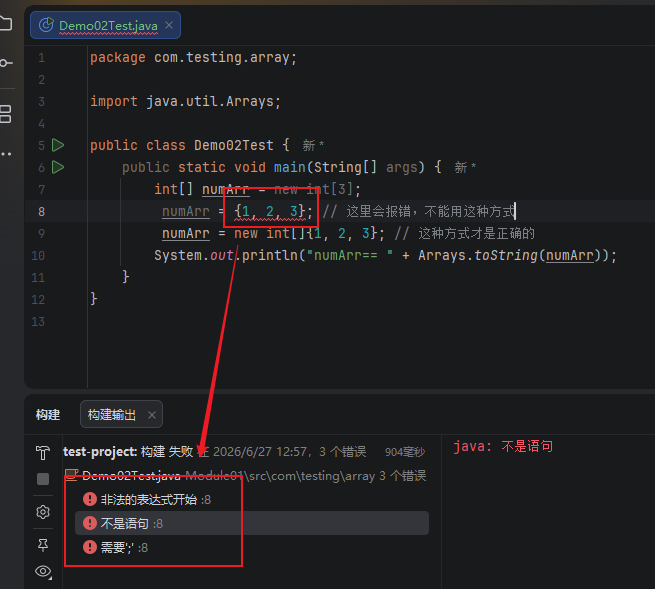
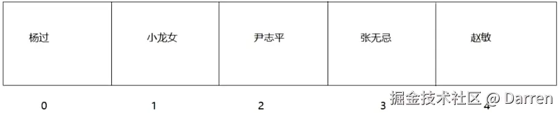
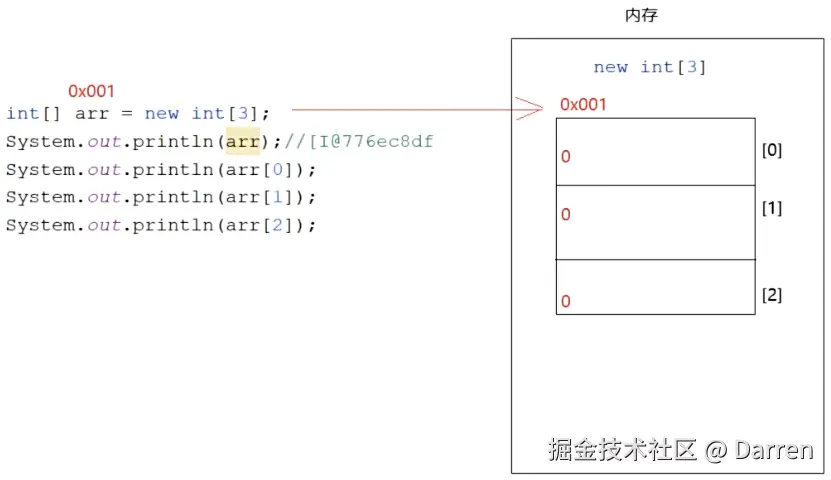
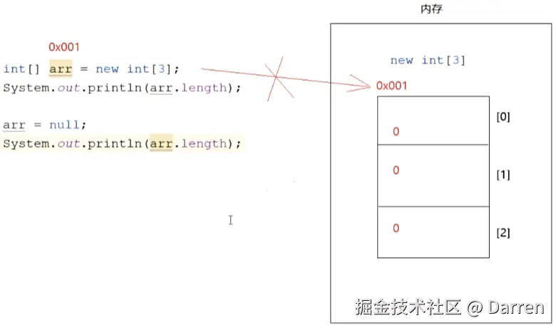
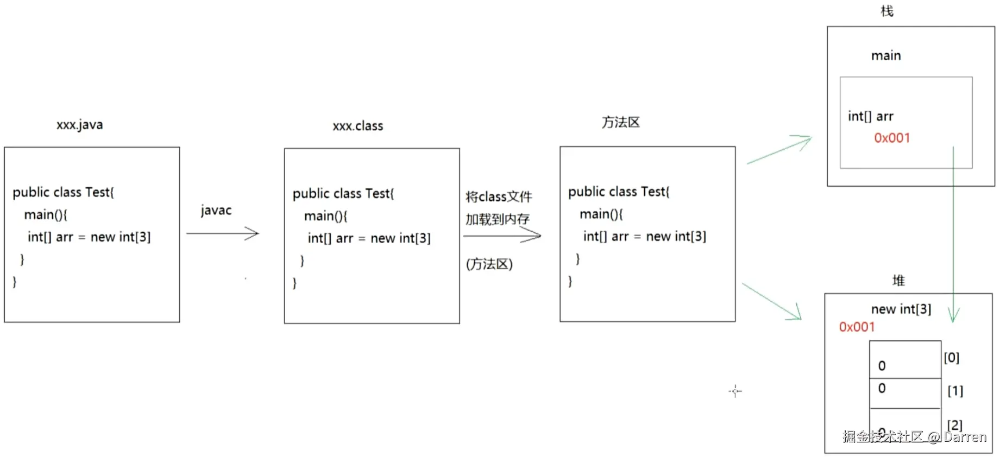
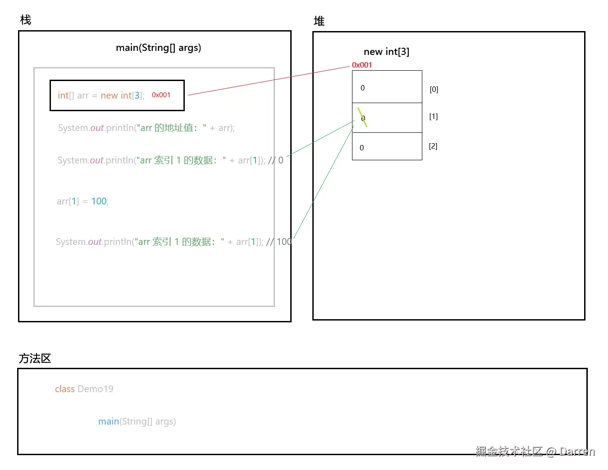
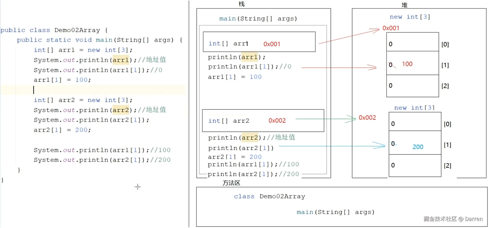
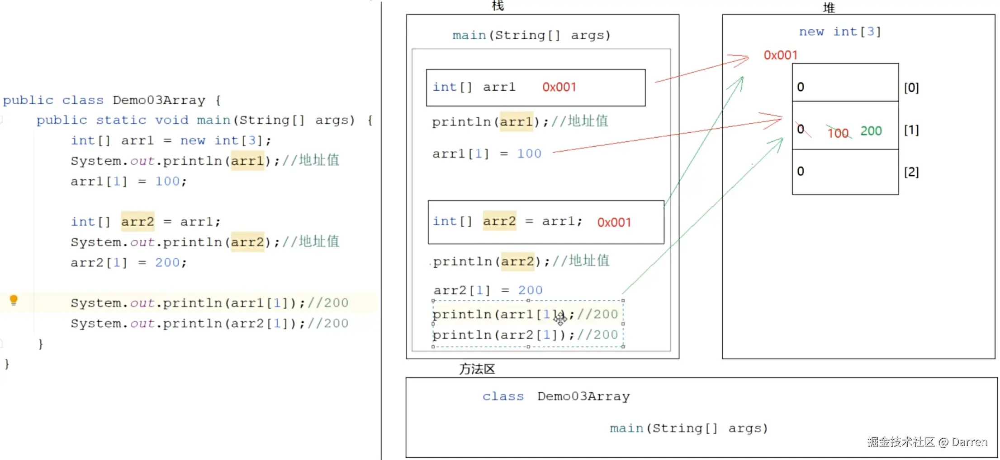
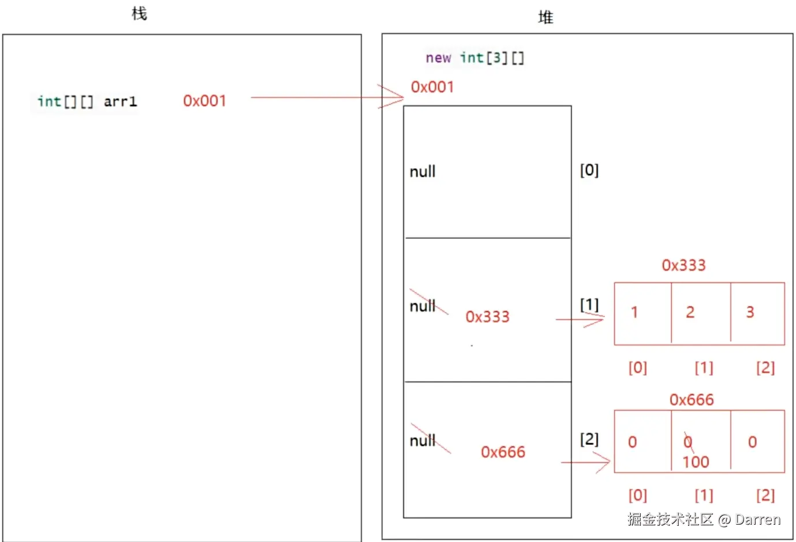

# 1 数组的概述和定义

**场景：** 当我们要存储一个数据时，可以使用变量，但是变量只能存储一个数据，如果想一个变量存储多条数据，该怎么做？

## 1.1 概述

数组是一个容器，可以满足我们一个变量存储多条数据的需求。

数组本身属于引用数据类型，它既可以存储基本数据类型，也可以存储引用数据类型，同时还具有定长特点（长度为多少，就存多少数据）。

## 1.2 定义

### 1.2.1 动态初始化

就是在定义数组时，没有给具体数据，只指定了长度：

```java
数据类型[] 数组名 = new 数据类型[长度];
数据类型 数组名[] = new 数据类型[长度];
```

```java
import java.util.Arrays;

public class Demo01 {
    public static void main(String[] args) {
        int[] numArr = new int[5];
        String[] strArr = new String[5];
        System.out.println("动态初始化-整型数组：" + Arrays.toString(numArr));
        System.out.println("动态初始化-字符常数组：" + Arrays.toString(strArr));
    }
}

/*
动态初始化-整型数组：[0, 0, 0, 0, 0]
动态初始化-字符常数组：[null, null, null, null, null]
*/
```

### 1.2.2 静态初始化

在定义数组的时候，直接给定数据

```java
数据类型[] 数组名 = {元素1, 元素2... };
数据类型 数组名[] = {元素1, 元素2... };
```

```java
import java.util.Arrays;

public class Demo02 {
    public static void main(String[] args) {
        int[] numArr = {1, 2, 3};
        String[] strArr = {"a", "b", "c"};
        System.out.println("静态初始化-整型数组" + Arrays.toString(numArr));
        System.out.println("静态初始化-字符串数组" + Arrays.toString(strArr));
    }
}

/*
静态初始化-整型数组：[1, 2, 3]
静态初始化-字符串数组：[a, b, c]
*/
```

**注意：** 用给定数据定义数组这种方式，只能在声明 + 初始化时使用，无法在赋值时使用。比如：

```java
import java.util.Arrays;

public class Demo02Test {
    public static void main(String[] args) {
        int[] numArr = new int[3];
        // numArr = {1, 2, 3}; // 这里在 Idea 会报错：此处不允许数组初始值设定项；代码运行之后，同时报错：非法的表达式开始/不是语句/需要;
        numArr = new int[]{1, 2, 3}; // 这种方式才是正确的
        System.out.println("numArr== " + Arrays.toString(numArr));
    }
}

/*
numArr== [1, 2, 3]
*/
```



### 1.2.3 动/静态初始化各部分释义

- 等号左边的数据类型：规定了数组中只能存储什么类型的数据；
- `[]`：代表的是数组和维度，一个 `[]` 代表一维数组，两个 `[][]` 代表二维数组（左边 `[]` 代表二维数组，右边 `[]` 代表一维数组）；
- 数组名：给定义的数组取的名字，遵循小驼峰命名法；
- `new` 关键字：代表创建数组；
- 等号右边的数据类型：跟等号左边的数据类型保持一致；
- `[长度]`：指定数组长度，规定了数组最多能存储多少条数据。

### 1.2.4 动/静态初始化的区别

- 动态初始化，只指定了长度，没有存具体数据。（适用于只知道长度，但不知道数据的场景）；
- 静态初始化，定义后即知道存什么数据（适用于知道具体数据的场景）。

# 2 数组的操作

## 2.1 获取数组长度

**操作格式：**

```java
数据类型[] 数组名 = {元素1, 元素2... };
数组名.length
```

**注意：** length 是属性，不是方法，切记后面不要带小括号。

```java
public class Demo03 {
    public static void main(String[] args) {
        int[] numArr = {1, 2, 3};
        System.out.println("numArr的长度为：" + numArr.length);
    }
}

/*
numArr的长度为：3
*/
```

## 2.2 数组索引

数组索引是元素在数组中存储的位置（下标）。

如下图，假设 5 个方格合在一起就是一个数组，每个方格块就是一个元素（包含里面的内容），方格块对应的数字就是它的下标：


**索引的特点：**

- 索引是唯一的；
- 索引都是从 0 开始的，最大索引是数组的长度 - 1。

**索引的作用：** 如果要操作数组元素，就必须通过索引来操作，比如：对元素的 `查、存、取`，都需要指定索引来操作。

## 2.2.1 往数组中存数据

**操作格式：**

```java
数据类型[] 数组名 = new 数据类型[长度];
数组名[索引值] = 值 // 将等号右边的值放到数组指定的索引位置
```

```java
import java.util.Arrays;

public class Demo04 {
    public static void main(String[] args) {
        int[] numArr = new int[3];
        numArr[0] = 11;
        numArr[1] = 22;
        numArr[2] = 33;
        String[] strArr = new String[3];
        strArr[0] = "AA";
        strArr[1] = "BB";
        strArr[2] = "CC";
        System.out.println("存了数据的整型数组：" + Arrays.toString(numArr));
        System.out.println("存了数据的字符串数组：" + Arrays.toString(strArr));
    }
}

/*
存了数据的整型数组：[11, 22, 33]
存了数据的字符串数组：[AA, BB, CC]
*/
```

```java
import java.util.Arrays;
import java.util.Scanner;

public class Demo05 {
    public static void main(String[] args) {
        int[] numArr = new int[3];
        Scanner sc = new Scanner(System.in);
        for (int i = 0; i < numArr.length; i++) {
            numArr[i] = sc.nextInt();
        }
        System.out.println("通过 Scanner 存数据：" + Arrays.toString(numArr));
    }
}

/*
111
222
333
通过 Scanner 存数据：[111, 222, 333]
*/
```

```java
import java.util.Arrays;
import java.util.Random;

public class Demo06 {
    public static void main(String[] args) {
        String[] strArr = new String[3];
        Random rd = new Random();
        for(int i = 0; i < strArr.length; i++) {
            strArr[i] = rd.nextInt(100) + "";
        }
        System.out.println("通过 Random 存数据：" + Arrays.toString(strArr));
    }
}

/*
通过 Random 存数据：[31, 64, 39]
*/
```

## 2.2.2 往数组中取数据

**操作格式：**

```java
数据类型[] 数组名 = new 数据类型[长度];
数组名[索引值] // 去除数组中指定索引位置的数据
```

**注意：**

- 直接输出数组名，输出的是数组在内存中的地址值（地址值是数组在内存中的唯一标识，通过这个唯一标识能在内存中找到这个数组，从而操作数组中的元素）；
  
- 如果数组中没有存数据，此时获取的是数组中的默认值，以下是一些类型的默认值：
  - 整数：0
  - 小数：0.0
  - 字符：'\u0000' -> 对应的 int 值是 0
  - 布尔值：false
  - 引用：null

```java
public class Demo07 {
    public static void main(String[] args) {
        int[] numArr = new int[3];
        System.out.println("numArr 的地址值：" + numArr);
        System.out.println("numArr 索引 0：" + numArr[0]);
        System.out.println("numArr 索引 1：" + numArr[1]);
        System.out.println("numArr 索引 2：" + numArr[2]);
    }
}

/*
numArr 的地址值：[I@10f87f48
numArr 索引 0：0
numArr 索引 1：0
numArr 索引 2：0
*/
```

## 2.2.3 遍历数组

```java
public class Demo08 {
    public static void main(String[] args) {
        int[] arr1 = {100, 200, 300};
        String[] arr2 = {"动漫1", "动漫2", "动漫3"};

        // 遍历 arr1
        for (int i = 0; i < arr1.length; i++) {
            System.out.println("遍历 arr1：" + arr1[i]);
        }

        // 遍历 arr2
        for (int i = 0; i < arr2.length; i++) {
            System.out.println("遍历 arr2：" + arr2[i]);
        }
    }
}

/*
遍历 arr1：100
遍历 arr1：200
遍历 arr1：300
遍历 arr2：动漫1
遍历 arr2：动漫2
遍历 arr2：动漫3
*/
```

## 2.3 常见的两个数组异常

### 2.3.1 ArrayIndexOutOfBoundsException

ArrayIndexOutOfBoundsException 翻译过来就是**数组索引越界异常**，意思就是操作数组时候的索引超出了数组索引的范围。

```java
public class Demo09 {
    public static void main(String[] args) {
        int[] arr = {100, 200, 300};
        for (int i = 0; i < arr.length; i++) {
            System.out.println("arr[" + i + "]：" + arr[i]);
        }
        System.out.println("arr[3] 已经超出了 arr 的长度范围：" + arr[3]);
    }
}

/*
arr[0]：100
arr[1]：200
arr[2]：300
Exception in thread "main" java.lang.ArrayIndexOutOfBoundsException: Index 3 out of bounds for length 3
	at com.testing.array.Demo09.main(Demo09.java:9)
*/
```

### 2.3.2 NullPrinterException

NullPrinterException 翻译过来就是**空指针异常**，当一个变量为 `null` 时，再通过数组读值的方式读取这个变量，就会出现此报错。

```java
public class Demo10 {
    public static void main(String[] args) {
        int[] arr = {1, 2, 3};
        arr = null;
        System.out.println("arr 空指针异常（arr[0]）==" + arr[0]);
    }
}

/*
Exception in thread "main" java.lang.NullPointerException: Cannot load from int array because "arr" is null
	at com.testing.array.Demo10.main(Demo10.java:7)
*/
```



## 2.4 数组练习

### 2.4.1 求出数组中的元素最大值

```java
public class Demo11 {
    public static void main(String[] args) {
        int[] arr = {12, 543, 765, 1, 656, 4, 7, 2};
        int max = arr[0];
        for (int i = 0; i < arr.length; i++) {
            if(max < arr[i]) {
                max = arr[i];
            }
        }
        System.out.println("arr 中的最大值为：" + max);
    }
}

/*
arr 中的最大值为：765
*/
```

### 2.4.2 随机生成 50 个 0~500 之间的整数，统计同时是 3 & 5 的倍数，但不是 7 的倍数的个数

```java
import java.util.Random;

public class Demo12 {
    public static void main(String[] args) {
        Random rd = new Random();
        int[] arr = new int[50];
        for (int i = 0; i < arr.length; i++) {
            arr[i] = rd.nextInt(501);
        }
        int count = 0;
        for (int j : arr) {
            if (j % 3 == 0 && j % 5 == 0 && j % 7 != 0) {
                count++;
            }
        }
        System.out.println("满足条件的个数为：" + count);
    }
}

/*
满足条件的个数为：3（注意：因为是随机生成的值，不是每次运行之后的结果都是3）
*/
```

### 2.4.3 定义一个数组，然后遍历，要求最终输出格式为 "[1,2,3,4]"

```java
public class Demo13 {
    public static void main(String[] args) {
        int[] num = {1, 2, 3, 4};
        System.out.print('[');
        for (int i = 0; i < num.length; i++) {
            String printStr = i == num.length - 1 ? "]" : ",";
            System.out.print(num[i] + printStr);
        }
    }
}

/*
[1,2,3,4]
*/
```

### 2.4.4 随机生成 50 个 1~100 之间的整数，然后统计偶数个数

```java
import java.util.Random;
import java.util.ArrayList;

public class Demo14 {
    public static void main(String[] args) {
        Random rd = new Random();
        int[] nums = new int[50];
        for (int i = 0; i < nums.length; i++) {
            nums[i] = rd.nextInt(100) + 1;
        }
        int count = 0;
        ArrayList<Integer> numList = new ArrayList<>();
        for (int i = 0; i < nums.length; i++) {
            if (nums[i] % 2 == 0) {
                count++;
                numList.add(nums[i]);
            }
        }
        System.out.println("偶数的个数为：" + count + "，偶数为：" + numList);
    }
}

/*
偶数的个数为：30，偶数为：[8, 62, 80, 92, 74, 10, 24, 76, 40, 52, 46, 4, 40, 34, 88, 38, 28, 72, 96, 16, 38, 82, 86, 48, 34, 96, 42, 96, 10, 72]（注意：因为是随机生成的值，每次运行后的结果都会不一样）
*/
```

### 2.4.5 键盘录入一个整数，找出它的索引，找到则返回索引号，找不到返回 -1

```java
import java.util.Scanner;

public class Demo15 {
    public static void main(String[] args) {
        int[] nums = {11, 18, 19, 20, 50};
        Scanner sc = new Scanner(System.in);
        int num = sc.nextInt();
        int index = -1;
        for (int i = 0; i < nums.length; i++) {
            if (num == nums[i]) {
                index = i;
                break;
            }
        }
        System.out.println("键盘输入的整数是：" + num + "，它的索引是：" + (index == -1 ? "未找到" : index));
        sc.close();
    }
}

/*
键盘输入：99
键盘输入的整数是：99，它的索引是：未找到
*/
```

### 2.4.6 数组复制

数组复制的本质是创建一个同等长度的新数组，然后将旧数组各个索引位置的值赋给新数组对应的位置。

```java
public class Demo16 {
    public static void main(String[] args) {
        int[] oldNums = {22, 33, 44, 55};
        int[] newNums = new int[4];
        for (int i = 0; i < oldNums.length; i++) {
            newNums[i] = oldNums[i];
        }
        for (int i = 0; i < newNums.length; i++) {
            System.out.println("新数组索引" + i + "的值：" + newNums[i]);
        }
    }
}

/*
新数组索引0的值：22
新数组索引1的值：33
新数组索引2的值：44
新数组索引3的值：55
*/
```

### 2.4.7 数组扩容

数组扩容本质也是创建一个新数组并替换旧数组的过程，根据需求定义一个新数组，其长度必须大于旧数组的长度（这是扩容的基本前提），再将旧数组对应位置的值赋给新数组，新数组剩余位置根据需要来使用，最后将新数组在堆中的地址值赋给旧数组的变量，从而完成了整个数组扩容的操作。

```java
import java.util.Arrays;

public class Demo17 {
    public static void main(String[] args) {
        int[] nums = {1,2,3};
        int[] newNums = new int[5];
        for (int i = 0; i < nums.length; i++) {
            newNums[i] = nums[i];
        }
        System.out.println("扩容前的 nums：" + Arrays.toString(nums));
        nums = newNums;
        System.out.println("扩容后的 nums：" + Arrays.toString(nums));
    }
}

/*
扩容前的 nums：[1, 2, 3]
扩容后的 nums：[1, 2, 3, 0, 0]
*/
```

### 2.4.8 数组合并

数组合并的本质也是创建一个新数组，长度为所需要合并的数组的长度的总和（如：有数组 A 和 B 需要合并，那么新数组的长度就是数组 A 的长度加上 B 的长度），然后依次将数组 A 和 B 的内容同步过来。

```java
import java.util.Arrays;

public class Demo18 {
    public static void main(String[] args) {
        int[] numA = {1, 2, 3};
        int[] numB = {11, 22, 33};
        int[] numSum = new int[numA.length + numB.length];
        for (int i = 0; i < numSum.length; i++) {
            if (i < numA.length) {
                numSum[i] = numA[i];
            } else {
                numSum[i] = numB[i - 3];
            }
        }
        System.out.println("numA：" + Arrays.toString(numA) + "，numB：" + Arrays.toString(numB) + "，numSum：" + Arrays.toString(numSum));
    }
}

/*
numA：[1, 2, 3]，numB：[11, 22, 33]，numSum：[1, 2, 3, 11, 22, 33]
*/
```

# 3 内存图

内存可以理解为我们口头上的“内存条”，所有的软件和程序运行起来都会进到内存中，占用和使用内存。

在 Java 的世界中，内存被分成了 5 块：

- **栈（Stack）**，主要用来运行方法，方法都会进到栈中运行，运行完之后，为了“腾出”空间，会“弹栈”。
- **堆（Heap）**，主要用来保存对象、数组，每 `new` 一次，都会在堆中开辟一个空间用来存储数据，并为这个空间分配一个地址值。**注意**，堆内存中的数据都是有默认值的：
  - 整数：0
  - 小数：0.0
  - 字符：'\u0000'
  - 布尔：false
  - 引用：null
- **方法区（Method Area）**，主要用来保存 `class` 文件以及其中（方法）的信息，也可叫代码的“预备区”，代码运行之前，都需要先进来这里。（如：你要运行某个 `java` 文件的 `main` 方法时，`java` 编译生成的 `class` 文件已经被保存到内存中了）
- **本地方法栈（Native Method Stack）**，专门用来运行 `native` 方法，本地方法可以理解为堆对 `java` 功能的补充，有很多功能 java 语言实现不了，就需要依靠本地方法来完成。
- **寄存器（PC Register）**，和 CPU 有关。



## 3.1 一个数组的内存图

```java
public class Demo19 {
    public static void main(String[] args) {
        int[] arr = new int[3];
        System.out.println("arr 的地址值：" + arr);
        System.out.println("arr 索引 1 的数据：" + arr[1]);
        arr[1] = 100;
        System.out.println("arr 索引 1 的数据：" + arr[1]);
    }
}

/*
arr 的地址值：[I@10f87f48
arr 索引 1 的数据：0
arr 索引 1 的数据：100
*/
```



## 3.2 两个数组的内存图



## 3.3 两个数组指向同一片空间



# 4 二维数组

二维数组就是在数组中再套一层数组。

## 4.1 二维数组的定义

### 4.1.1 动态初始化

```java
// 方式1：
数据类型[][] 数组名 = new 数据类型[m][n];

// 方式2：
数据类型 数组名[][] = new 数据类型[m][n];

// 方式3：
数据类型[] 数组名[] = new 数据类型[m][n];
```

- m 代表的是二维数组的长度；
- n 代表的是二维数组中每个一维数组的长度。

**注意：**

```java
数据类型[][] 数组名 = new 数据类型[m][];
```

当二维数组中的一维数组不指定长度时，表示一维数组没有被创建，而对应引用数据类型的默认值是 `null`。所以，这个二维数组是 `[null, null, ...m]`

### 4.1.2 静态初始化

```java
// 方式1：
数据类型[][] 数组名 = new 数据类型[m][n]{{元素1, 元素2...}, {元素1, 元素2...}, ...};

// 方式2：
数据类型 数组名[][] = new 数据类型[m][n]{{元素1, 元素2...}, {元素1, 元素2...}, ...};;

// 方式3：
数据类型[] 数组名[] = new 数据类型[m][n]{{元素1, 元素2...}, {元素1, 元素2...}, ...};;
```

**简化形式：**

```java
// 方式1：
数据类型[][] 数组名 = {{元素1, 元素2...}, {元素1, 元素2...}, ...};

// 方式2：
数据类型 数组名[][] = {{元素1, 元素2...}, {元素1, 元素2...}, ...};;

// 方式3：
数据类型[] 数组名[] = {{元素1, 元素2...}, {元素1, 元素2...}, ...};;
```

### 4.1.3 动态初始化和静态初始化的区别

动态初始化在定义的时候就指定了二维和一维数组的长度（二维数组里面的一维数组长度是统一的），而静态初始化时的二维和一维数组的长度可以自由指定（二维数组里面的每个一维数组长度可以相同，也可以不同）。

```java
import java.util.Arrays;

public class Demo20 {
    public static void main(String[] args) {
        // 动态初始化
        String[][] arr1 = new String[2][2];
        String arr2[][] = new String[3][3];
        String[] arr3[] = new String[4][4];
        System.out.println("动态初始化-arr1==" + Arrays.deepToString(arr1));
        System.out.println("动态初始化-arr2==" + Arrays.deepToString(arr2));
        System.out.println("动态初始化-arr3==" + Arrays.deepToString(arr3));

        // 静态初始化
        String[][] arr4 = {{"AA", "BB"}, {"CC"}};
        String arr5[][] = {{"D"}, {"E"}};
        String[] arr6[] = {{"AA", "BB"}, {"CC"}, {"DD", "EE", "FF"}};
        System.out.println("静态初始化-arr4==" + Arrays.deepToString(arr4));
        System.out.println("静态初始化-arr5==" + Arrays.deepToString(arr5));
        System.out.println("静态初始化-arr6==" + Arrays.deepToString(arr6));
    }
}

/*
动态初始化-arr1==[[null, null], [null, null]]
动态初始化-arr2==[[null, null, null], [null, null, null], [null, null, null]]
动态初始化-arr3==[[null, null, null, null], [null, null, null, null], [null, null, null, null], [null, null, null, null]]
静态初始化-arr4==[[AA, BB], [CC]]
静态初始化-arr5==[[D], [E]]
静态初始化-arr6==[[AA, BB], [CC], [DD, EE, FF]]
*/
```

## 4.2 获取二维数组的长度

```java
public class Demo21 {
    public static void main(String[] args) {
        // 通过 二维数组.length 就可以直接获取二维数组的长度
        String[][] arr = {{"A", "B"}, {"C"}, {"D", "E", "F"}};
        System.out.println("二维数组的长度==" + arr.length);

        // 如果要获取二维数组中的一维数组长度，则需要遍历二维数组获取其中的一维数组，然后通过 “一维数组.length” 可直接获取一维数组的长度。
        for (int i = 0; i < arr.length; i++) {
            System.out.println("下标为 " + i + " 的一维数组的长度是==" + arr[i].length);
        }
    }
}

/*
二维数组的长度==3
下标为 0 的一维数组的长度是==2
下标为 1 的一维数组的长度是==1
下标为 2 的一维数组的长度是==3
*/
```

## 4.3 二维数组的存、取和遍历

### 4.3.1 存

可以结合二维和一维数组的下标来在对应位置存储数据。

```java
数组名[i][j] = 值;

// i 代表的是一维数组在二维数组中的索引
// j 代表的是一维数组中元素的索引
```

```java
import java.util.Arrays;

public class Demo22 {
    public static void main(String[] args) {
        String[][] arr = new String[3][3];
        arr[0][0] = "111";
        arr[0][1] = "222";
        arr[1][1] = "333";
        System.out.println(Arrays.deepToString(arr));
    }
}

/*
[[111, 222, null], [null, 333, null], [null, null, null]]
*/
```

### 4.3.2 取

可以结合二维和一维数组的下标来获取目标元素。

```java
数组名[i][j];

// i 代表的是一维数组在二维数组中的索引
// j 代表的是一维数组中元素的索引
```

```java
public class Demo23 {
    public static void main(String[] args) {
        String[][] arr = {{"AA", "BB"}, {"CC"}};
        String targetItem = arr[0][1];
        System.out.println("取二维数组中的第一个一维数组，并拿到它的第二个元素==" + targetItem);
    }
}

/*
取二维数组中的第一个一维数组，并拿到它的第二个元素==BB
*/
```

### 4.3.3 遍历

先遍历二维数组，拿到二维数组中的每个一维数组，再遍历一维数组拿到里面的元素。

```java
import java.util.Arrays;

public class Demo24 {
    public static void main(String[] args) {
        String[][] arr = {{"AA", "BB"}, {"CC"}, {"DD", "EE", "FF"}};
        for(String[] it: arr) {
            System.out.println("当前的一维数组==" + Arrays.toString(it));
            for(int i = 0; i < it.length; i++){
                System.out.println("一维数组中下标为 " + i + " 的元素==" + it[i]);
            }
        }
    }
}

/*
当前的一维数组==[AA, BB]
一维数组中下标为 0 的元素==AA
一维数组中下标为 1 的元素==BB
当前的一维数组==[CC]
一维数组中下标为 0 的元素==CC
当前的一维数组==[DD, EE, FF]
一维数组中下标为 0 的元素==DD
一维数组中下标为 1 的元素==EE
一维数组中下标为 2 的元素==FF
*/
```

## 4.4 二维数组内存图

以下面这段代码为例，结合内存图分析过程：

```java
import java.util.Arrays;

public class Demo25 {
    public static void main(String[] args) {
        int[][] arr1 = new int[3][];
        arr1[1] = new int[]{1, 2, 3};
        arr1[2] = new int[3];
        arr1[2][1] = 100;
        System.out.println(Arrays.deepToString(arr1));
    }
}

/*
arr1是：[null, [1, 2, 3], [0, 100, 0]]
*/
```


