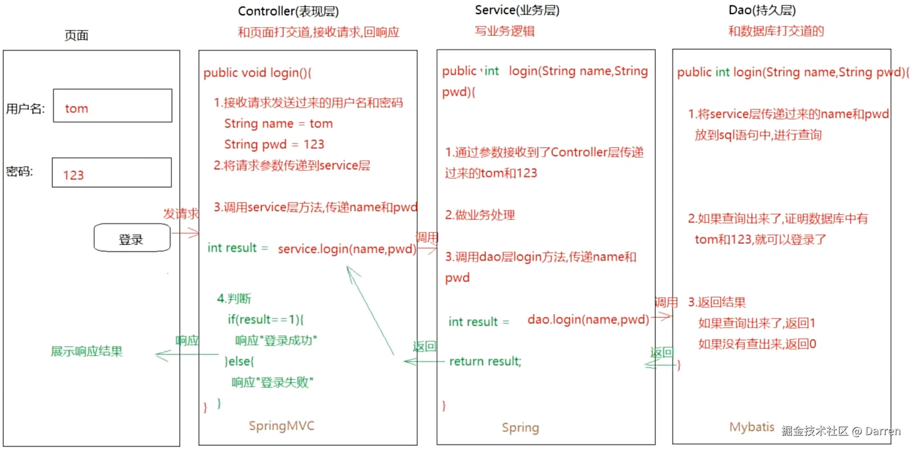

# 1 方法的介绍和使用

**方法：** 就是拥有功能性代码的代码块。通常不同功能的代码会放在不同的方法中，这样也便于使用和维护。

**注意：** 方法和方法之间是平级关系，不要嵌套。

**Tips：** 在 `Idea` 中，通过`设置 -> 编辑器 -> 常规 -> 外观 -> 显示方法分隔符（勾选）`，就可以在不同方法之间显示横线分隔符。

## 1.1 定义格式

```java
修饰符 返回值类型 方法名 (参数) {
    方法体;
    return 结果;
}
```

**组成部分：**

- 修饰符：`public static` 详细部分见面向对象章节
- 返回值类型：表示方法最终返回的结果的数据类型
  - 如：return 1 -> 返回值类型为 `int`
  - 如：return 2.5 -> 返回值类型为 `double`
  - 如：return "" -> 返回值类型为 `String`
  - 没有返回值类型，则写 `void`
- 方法名：见名知意，一般用小驼峰命名
- 参数：进入到方法内部参与代码执行的数据，格式为：`数据类型 变量名`，如：`(int age, String: name)`
- 方法体：实现该方法的具体代码
- return 结果：如有返回值，则可以使用 `return` 关键字将结果返回，如果没有可以不用

## 1.2 通用定义格式

### 1.2.1 无参无返回值方法

```java
public static void 方法名 () {
    方法体; // 实现此方法的具体代码
}

方法名() // 调用方法
```

**注意：**

- `void` 关键字代表该方法无返回值，如果有 `void` 就不用写 `return 结果;`；
- 方法之间是平级关系，不能嵌套（一个方法不能定义在另一个方法内部，所有方法都必须是类的直接成员）；
- 方法需要调用了才能执行内部的代码；
- 方法的执行顺序和调用顺序有关。

```java
public class Demo01 {
    public static void main(String[] args) {
        farmer();
        cook();
        consumer();
    }

    public static void farmer(){
        System.out.println("1");
        System.out.println("2");
        System.out.println("3");
    };

    public static void cook(){
        System.out.println("4");
        System.out.println("5");
        System.out.println("6");
    };

    public static void consumer(){
        System.out.println("7");
        System.out.println("8");
        System.out.println("9");
    };
}

/*
1
2
3
4
5
6
7
8
9
*/
```

### 1.2.2 无参有返回值方法

```java
public static 返回值类型 方法名 () {
    方法体; // 实现此方法的具体代码
    return 结果;
}

方法名() // 调用方法
```

```java
public class Demo03 {
    public static void main(String[] args) {
        int res = sum();
        System.out.println("无参有返回值==" + res);
    }

    public static int sum() {
        int num1 = 30, num2 =40;
        return num1 + num2;
    }
}

/*
无参有返回值==70
*/
```

### 1.2.3 有参无返回值方法

```java
public static void 方法名 (数据类型 变量) {
    方法体; // 实现此方法的具体代码
}

方法名() // 调用方法
```

```java
public class Demo02 {
    public static void main(String[] args) {
        sum(10, 20);
    }

    public static void sum(int num1, int num2) {
        int sum = num1 + num2;
        System.out.println("sum方法==" + sum);
    }
}

/*
有参无返回值==30
*/
```

### 1.2.4 有参有返回值方法

```java
public static 返回值类型 方法名 (数据类型 变量) {
    方法体; // 实现此方法的具体代码
    return 结果;
}

方法名() // 调用方法
```

```java
public class Demo04 {
    public static void main(String[] args) {
        int res = sum(11,22);
        System.out.println("有参有返回值==" + res);
    }

    public static int sum(int num1, int num2) {
        return num1 + num2;
    }
}

/*
有参无返回值==30
*/
```

## 1.3 参数和返回值的使用

## 1.3.1 形参和实参

- **形参**，全称为形式参数，在定义方法的时候形式上定义的参数，此时定义的参数还没有具体的值；
- **实参**，全称为实际参数，在调用方法的时候赋予形参的具体的值。

## 1.3.2 参数和返回值的使用时机

- **参数的使用时机**，当一个方法需要依赖外部的数据时，就需要定义形参来接收外部传入的值；
- **返回值的使用时机**，当外部需要用到方法内部（经过处理）的某个结果时，就需要将该结果返回，以给外部使用。

下图的登录过程就可以很好诠释参数和返回值的使用时机：



## 1.4 注意事项

- 方法先定义再调用；
- 方法不调用不执行；
- 方法执行顺序跟调用顺序有关
- `void` 和 `return 结果;` 不能共存，但跟 `return;` 能共存；
- 同个类下的方法不能嵌套，但是可以在内部类定义；
- 同个方法同个逻辑块下，只能有一个 `return` 关键字；
- 将变量传递给方法的参数时，实际传递的时变量所代表的数据，而不是变量本身；

# 2 方法的练习

## 2.1 练习 1 - 键盘录入一个整数，判断奇偶性

```java
import java.util.Scanner;

public class Demo05 {
    public static void main(String[] args) {
        Scanner sc = new Scanner(System.in);
        int num = sc.nextInt();
        String res = isEven(num);
        System.out.println(num + "是：" + res);
    }

    public static String isEven(int num) {
        return num % 2 == 0 ? "偶数" : "奇数";
    }
}

/*
键盘输入：11
11是：奇数
*/
```

## 2.2 练习 2 - 求 1 到 100 的和

```java
public class Demo06 {
    public static void main(String[] args) {
        summary();
    }

    public static void summary() {
        int sum = 0;
        for (int i = 1; i <= 100; i++) {
            sum += i;
        }
        System.out.println("1 到 100 的和是：" + sum);
    }
}

/*
1 到 100 的和是：5050
*/
```

## 2.3 练习 3 - 按键盘录入的整数来打印对应个数的内容

```java
import java.util.Scanner;

public class Demo07 {
    public static void main(String[] args) {
        Scanner sc = new Scanner(System.in);
        int num = sc.nextInt();
        print(num);
    }

    public  static void print(int num) {
        for (int i = 0; i < num; i++) {
            System.out.println("我爱学习，第" + (i + 1) + "遍");
        }
    }
}

/*
键盘输入：2
我爱学习，第1遍
我爱学习，第2遍
*/
```

## 2.4 练习 4 - 传一个定义的数组到方法中遍历

```java
public class Demo08 {
    public static void main(String[] args) {
        int[] numArr = {1, 2, 3};
        mapArr(numArr);
    }

    public static void mapArr(int[] numArr) {
        for (int j : numArr) {
            System.out.println("在方法中遍历数组：" + j);
        }
    }
}

/*
在方法中遍历数组：1
在方法中遍历数组：2
在方法中遍历数组：3
*/
```

## 2.4 练习 5 - 在方法中返回数组

```java
import java.util.Arrays;

public class Demo09 {
    public static void main(String[] args) {
        int[] resArr = returnArr();
        System.out.println(Arrays.toString(resArr));
    }

    public static int[] returnArr (){
        int num1 = 22, num2 = 5;
        return new int[]{num1 - num2, num1 + num2};
    };
}

/*
[17, 27]
*/
```

# 3 方法重载

概述：方法名相同，参数列表不同的方法。

参数列表不同，具体可以体现在下面三个方面：

- 参数个数不同；
- 参数类型不同；
- 参数类型顺序不同

```java
public class Demo10 {
    public static void main(String[] args) {
        sum(11);
        sum(11, 22);
        sum(11, 2.2);
        sum(1.1, 22);
    }

    public static void sum(int a) {
        System.out.println(a);
    }

    // 参数个数不同
    public static void sum(int a, int b) {
        System.out.println(a + b);
    }

    // 参数类型不同
    public static void sum(int a, double b) {
        System.out.println(a + b);
    }

    // 参数类型顺序不同
    public static void sum(double a, double b) {
        System.out.println(a + b);
    }
}

/*
11
33
13.2
23.1
*/
```

**注意：** 以下两个条件不同，并不代表它们是重载

- 参数名不同

```java
public static void sum(int a) {
    System.out.println(a);
}

public static void sum(int b) {
    System.out.println(b);
}
```

- 返回值类型不同

```java
public static int sum(int a) {
    return 111;
}

public static double sum(int b) {
    return 111.111;
}
```

## 案例

```java
public static void sum() {}  // 重载方法
public static void SUM() {}  // 非重载方法
public static void sum(int a) {}  // 重载方法
static void sum(int a, int b) {}  // 重载方法
public static void sum(int g, int h) {}  // 非重载方法
public static void sum(double a, int b) {}  // 重载方法
public static void sum(int a, double b) {}  // 重载方法
public static void sum(int c, double d) {}  // 非重载方法
```

**使用场景：** 对于方法功能一样，实现细节不一样，就可以使用方法重载。
