# 1 类和对象

## 1.1 面向对象的介绍

### 1.1.1 面向过程

是一种以 **过程** 或 **函数** 为中心的编程范式，它强调的是 **解决问题的步骤**。程序被分解为一系列函数或过程的集合，每个函数负责完成一个特定的任务，数据和操作数据的函数是分离的。面向过程编程的核心在于 **如何通过一系列步骤来达到目标**。

**类比：** 像做菜，按照菜谱一步步操作，每个步骤是独立的（切菜、炒菜、调味），但需要自己管理材料和工具。

**适用场景：** 适合解决简单、线性流程的问题，代码结构清晰，但扩展性和复用性较差。

**示例：** 实现计算器程序，下面是面向过程的代码。

```python
def add(a, b):
    return a + b

def subtract(a, b):
    return a - b

def multiply(a, b):
    return a * b

def divide(a, b):
    if b == 0:
        raise ValueError("Division by zero")
    return a / b

# 使用函数
result = add(5, 3)
print(result)  # 输出 8
```

### 1.1.2 面向对象

面向对象是一种以 **对象** 为中心的编程范式，它强调的是 **数据和操作数据的方法的封装**。程序被组织为一系列对象的集合，每个对象包含数据（属性）和操作这些数据的方法（行为）。面向对象编程的核心在于 **如何通过对象之间的交互来解决问题**。

**类比：** 像点外卖，你只需要告诉商家（对象）你要什么菜，商家会处理所有细节（切菜、炒菜、调味），你只需要等待结果。

**适用场景：** 适合解决复杂问题，通过封装、继承和多态等特性提高代码的复用性和扩展性，更符合人类的思维方式。

**示例：** 实现计算器程序，下面是面向对象的代码。

```python
class Calculator:
    def add(self, a, b):
        return a + b

    def subtract(self, a, b):
        return a - b

    def multiply(self, a, b):
        return a * b

    def divide(self, a, b):
        if b == 0:
            raise ValueError("Division by zero")
        return a / b

# 使用对象
calc = Calculator()
result = calc.add(5, 3)
print(result)  # 输出 8
```

## 1.2 类和对象的介绍

### 1.2.1 类

之前我们学习接触到的类，主要是**测试类（带 main 方法的类）**，其主要是用来运行代码。

接下来学习的是 **实体类**，它主要是一类事物的抽象表示形式，比如：人类、动物类、手机类等。下面会举例说明。

#### 类的组成部分

类的组成部分主要分为两种：**属性（成员变量）** 和 **行为（成员方法）**

- **属性（成员变量）**，用于描述类对象的状态的数据
  - 定义位置：定义在类中的方法外面
  - 作用范围：作用于当前类
  - 定义格式：`数据类型 变量名`
  - 定义的时候，可以不用初始化赋值，会有默认值：
    - 整数：0
    - 小数：0.0
    - 字符：`'\u0000'`
    - 布尔：`false`
    - 引用：`null`
- **行为（成员方法）**，用于描述对象可以执行的操作或功能。

#### 示例

以下几个类都属于同个包：`package com.testing.oop.Demo01;`。

```java
public class Person {
    String name;
    int age;

    public void eat() {
        System.out.println("干饭");
    }

    public void drink() {
        System.out.println("喝饮料");
    }
}
```

```java
public class Phone {
    String brand;

    public void call(){
        System.out.println("打电话");
    }
}
```

```java
public class Animal {
    String kind;
    int num;

    public void statistics(){
        System.out.println("统计动物数量：" + num);
    }
}
```

```java
public class Demo01 {
    public static void main(String[] args) {
        Person person = new Person();
        person.eat();
        Phone phone = new Phone();
        phone.call();
        Animal animal = new Animal();
        animal.num = 100;
        animal.statistics();
    }
}
```

**注意：** 在同个包下的类可以直接使用，而无需导包。

### 1.2.2 对象

概述：一类事物的具体体现。

使用：

- 导包：`import 包名.类名`；
- 创建对象，想要使用哪个类中的成员，就 new 哪个类
- 调用成员（成员变量、成员方法），通过 new 出来的对象就可以使用构造出该对象的类里面变量和方法。

```java
package com.testing.oop.Demo02;

public class Phone {
    String brand;
    String color;
    int price;

    public void call(String name) {
        String callStr1 = "用价格为" + price + "的" + color + brand;
        String callStr2 = "给" + name + "打电话";
        System.out.println(callStr1 + callStr2);
    }

    public String message(String name) {
        return "给" + name + "发短信";
    }
}
```

```java
package com.testing.oop.Demo02;

public class Demo02 {
    public static void main(String[] args) {
        Phone phone = new Phone();
        phone.brand = "HUAWEI";
        phone.color = "黑色";
        phone.price = 5220;

        phone.call("王思聪");
        String sms = phone.message("柳岩");
        System.out.println(sms);
    }
}

/*
用价格为5220的黑色HUAWEI给王思聪打电话
给柳岩发短信
*/
```

## 1.3 匿名对象的使用

匿名对象是指创建对象（new 一个对象）时，不将对象赋值给任何变量，而直接使用对象。

匿名对象的使用时机：当只需要调用一个对象的方法，且不涉及变量的赋值时，可以使用匿名对象。

```java
package com.testing.oop.Demo03;

public class Person {
    String name = "";

    public void eat() {
        if (name.isEmpty()) {
            System.out.println("人要吃饭！");
        } else {
            System.out.println(name + "要吃饭！");
        }
    }
}
```

```java
package com.testing.oop.Demo03;

public class Demo03 {
    public static void main(String[] args) {
        Person person = new Person();
        person.name = "姚明";
        person.eat();

        new Person().eat();
    }
}

/*
姚明要吃饭！
人要吃饭！
*/
```

## 1.4 对象的内存图

### 1.4.1 一个对象的内存图

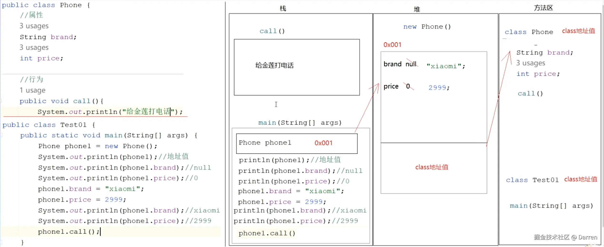

### 1.4.2 两个对象的内存图

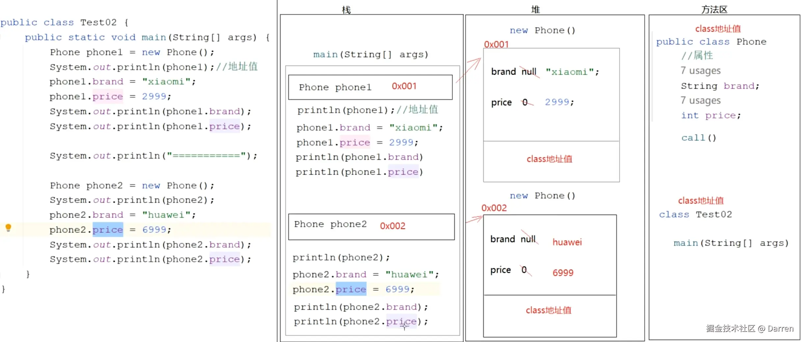

同个 `class` new 出来两个不同的对象，在内存堆中是各自管理自己的成员变量的，彼此之间互不影响。

### 1.4.3 两个对象指向同一片堆空间的内存图

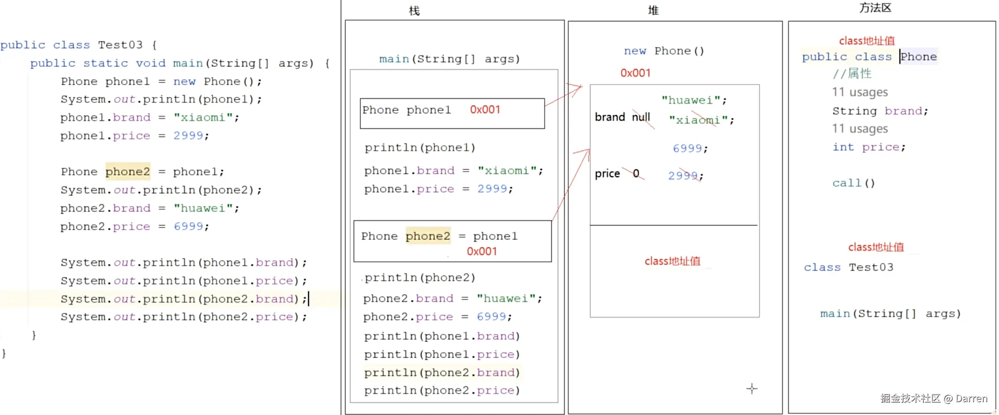

两个变量指向同个实例对象，当改变其中一个变量（存储着对象地址）的某个成员变量时，另外一个变量（存储着同个对象地址）也会被同步修改。

## 1.5 成员变量和局部变量的区别

**示例代码：**

```java
public class Person {
    // 成员变量定义在类内，方法的外面，作用于当前类
    String name; // 没有初始化赋值，引用类型默认是 null
    int age; // 没有初始化赋值，int 类型默认是 0

    public void eat() {
        // 局部变量定义方法的代码块内，作用于当前代码块
        // String food;
        // System.out.println(food); // 未初始化赋值就使用 food，会报错："变量 'food' 可能尚未初始化"
        System.out.println("干饭");
    }

    public void drink(String thing) {
        // 或者局部变量定义在方法的参数上，作用于当前代码块
        System.out.println("喝饮料" + thing);
    }
}
```

**主要有以下区别：**

| 序号 | 区别点   | 成员变量                                   | 局部变量                                           |
| ---- | -------- | ------------------------------------------ | -------------------------------------------------- |
| 1    | 定义位置 | 定义在类中方法的外面                       | 定义在方法体内，或者方法参数中                     |
| 2    | 初始化值 | 初始化后有默认值，不用手动赋值也可直接使用 | 初始化后没有默认值，必须手动赋值才能使用，否则报错 |
| 3    | 作用范围 | 作用于整个 `class` 中                      | 作用于当前方法体内其所在的代码块                   |
| 4    | 生命周期 | 随着对象的创建而产生，消失而消失           | 随着方法的调用而产生，调用完毕而消失               |
| 5    | 内存位置 | 在内存堆中，跟着实例对象位置走             | 在内存栈中，跟着方法走                             |

## 1.6 练习

定义一个 MyDate 类，要求成员变量有：year、month、day，再定义一个 Citizen 类，要求成员变量有：name、birthday、idCard，为这三个成员变量赋值，并取值打印。

```java
package com.testing.oop.Demo04;

public class MyDate {
    String year;
    String month;
    String day;
}
```

```java
package com.testing.oop.Demo04;

public class Citizen {
    String name;
    MyDate birthday = new MyDate();
    String idCard;
}
```

```java
package com.testing.oop.Demo04;

public class Demo04 {
    public static void main(String[] args) {
        Citizen citizen = new Citizen();
        citizen.name = "江哥";
        citizen.birthday.year = "2025";
        citizen.birthday.month = "07";
        citizen.birthday.day = "07";
        citizen.idCard = "auth123";

        System.out.println(citizen.name + "_" + citizen.birthday.year + citizen.birthday.month + citizen.birthday.day + "_" + citizen.idCard);
    }
}

/*
江哥_20250707_auth123
*/
```

# 2 封装

封装的本质是 **信息隐藏** 和 **接口暴露**。通过将对象的内部状态（属性）和行为（方法）绑定成一个整体，并对外部隐藏实现细节，仅通过公共接口与外界交互。

这种设计模式有利于：

- **保护数据安全**：防止外部直接修改对象的内部状态（如通过 `private` 修饰属性）
- **降低耦合度**：外部代码只需依赖接口，无需关心内部实现，从而提高代码的可维护性和扩展性
- **模块化设计**：将功能封装为独立的单元，便于复用和测试

样例 1：

java 内部封装的类

```java
package com.testing.oop.Demo05;

import java.util.Arrays;

public class Demo05Test01 {
    public static void main(String[] args) {
        int[] arr = {1, 2, 3, 4};

        // 这里的 toString 就是一个封装好的功能，通过外界的参数来与其进行交互
        System.out.println(Arrays.toString(arr));
    }
}

/*
[1, 2, 3, 4]
*/
```

样例 2：

把一些功能封装到函数里面，也是封装

```java
package com.testing.oop.Demo05;

public class Demo05Test02 {
    public static void main(String[] args) {
        int[] arr = {11, 22, 33, 44};
        String res = customToString(arr);
        System.out.println(res);
    }

    // 封装自定义 toString 功能
    public static String customToString(int[] arr) {
        StringBuilder sb = new StringBuilder();
        sb.append("[");
        for (int i = 0; i < arr.length; i++) {
            if (i > 0) {
                sb.append(',');
            }
            sb.append(arr[i]);
        }
        sb.append("]");

        return sb.toString();
    }
}

/*
[11,22,33,44]
*/
```

样例 3：

定义一个类的私有属性（private），并暴露对应的获取和设置接口，也是封装，private 的属性，在类外是无法被访问的，只能在类内访问，如果要访问和改变 private 属性，需要通过暴露的 get/set 接口来访问操作。

```java
package com.testing.oop.Demo05;

public class Person {
    private String name;
    private int age;

    public String getName() {
        return this.name;
    }

    public int getAge() {
        return this.age;
    }

    public void setName(String name) {
        this.name = name;
    }

    public void setAge(int age) {
        if (age < 0 || age > 150) {
            System.out.println("您是神仙！");
        } else {
            this.age = age;
        }
    }
}
```

```java
package com.testing.oop.Demo05;

public class Demo05Test03 {
    public static void main(String[] args) {
        Person p = new Person();
        // p.name  // 因为 name 是 private，会提示：'name' 在 'com.testing.oop.Demo05.Person' 中具有 private 访问权限
        // p.age  // 因为 age 是 private，会提示：'age' 在 'com.testing.oop.Demo05.Person' 中具有 private 访问权限
        System.out.println("没有 set name & age 之前，Name==" + p.getName() + "，Age==" + p.getAge() );
        p.setName("鸣人");
        p.setAge(20);
        System.out.println("set name & age 之后，Name==" + p.getName() + "，Age==" + p.getAge() );
    }
}

/*
没有 set name & age 之前，Name==null，Age==0
set name & age 之后，Name==鸣人，Age==20
*/
```

## 2.1 关于 `class` 中的 `this`

在类中，`this` 指向 new 出的当前对象。例如：new 出来的一个对象，调用这个对象中的某个方法，方法中 `this` 的指向就是这个对象。

```java
package com.testing.oop.Demo05;

public class Person {
    public void findThis(String indicator) {
        System.out.println(indicator + ": " + this);
    }
}
```

```java
package com.testing.oop.Demo05;

public class Demo05Test04 {
    public static void main(String[] args) {
        Person p1 = new Person();
        System.out.println("对象p1：" + p1);
        p1.findThis("p1"); // this 指向当前对象的地址值

        Person p2 = new Person();
        System.out.println("对象p2：" + p2);
        p2.findThis("p2"); // this 指向当前对象的地址值
    }
}

/*
对象1：com.testing.oop.Demo05.Person@23fc625e
p1: com.testing.oop.Demo05.Person@23fc625e
对象2：com.testing.oop.Demo05.Person@3a71f4dd
p2: com.testing.oop.Demo05.Person@3a71f4dd
*/
```

当成员变量和局部变量重名时，通过 `this` 能清楚区分二者。

```java
public class Person {
    private String name;

    public void setName(String name) {
        this.name = name;
        // name = name  // 如果不使用 this，就是 setName 这个函数的局部变量 name 给自己赋值了一次
    }
}
```

## 2.2 class 的构造方法

`构造方法` 就是方法名和类名一致，并能初始化对象状态的方法。其特点是：

- 方法名和类名一致；
- 方法不用写返回值类型；
- 可以有参数，也可以无参数；
- 在 `new` 对象的时候自动创建和调用

主要作用，可以初始化对象的状态，给成员变量赋值。

`构造方法` 主要分为两种，`无参构造` 和 `有参构造`。

**注意：**当你不提供构造函数的时候，`jvm` 会自动为类加上无参构造函数（只会提供无参构造函数）。但当你加上有参构造函数后，`jvm` 将不再提供无参构造函数，需要你自己添加无参构造重载函数。建议定义有参构造函数的同时也加上无参构造函数。

### 2.1 无参构造

格式：

```java
public 类名() {}
```

示例：

```java
package com.testing.oop.Demo06;

public class Man {
    public Man() {
        // new 对象的时候，这里的代码会自动调用
        System.out.println("Man的无参构造函数！");
    }
}
```

```java
package com.testing.oop.Demo06;

public class Demo06 {
    public static void main() {
        Man m = new Man();
    }
}

/*
Man的无参构造函数！
*/
```

### 2.2 有参构造

格式：

```java
public 类名(形参, ...) {
    为属性（成员变量）赋值
}
```

示例：

```java
package com.testing.oop.Demo07;

public class Human {
    String name;
    int age;

    public Human() {
        System.out.println("Human的有参构造函数-重载函数1-无参");
    }

    public Human(String name) {
        this.name = name;
        System.out.println("Human的有参构造函数-重载函数2-有 name 参数");
    }

    public Human(int age) {
        this.age = age;
        System.out.println("Human的有参构造函数-重载函数3-有 age 参数");
    }

    public Human(String name, int age) {
        this.name = name;
        this.age = age;
        System.out.println("Human的有参构造函数-重载函数4-有 name 和 age 参数");
    }
}
```

```java
package com.testing.oop.Demo07;

public class Demo07 {
    static void main() {
        Human h1 = new Human();
        System.out.println("h1--name：" + h1.name + "，age：" + h1.age);

        Human h2 = new Human("韩立");
        System.out.println("h2--name：" + h2.name + "，age：" + h2.age);

        Human h3 = new Human(280);
        System.out.println("h3--name：" + h3.name + "，age：" + h3.age);

        Human h4 = new Human("韩道友", 280);
        System.out.println("h4--name：" + h4.name + "，age：" + h4.age);
    }
}

/*
Human的有参构造函数-重载函数1-无参
h1--name：null，age：0
Human的有参构造函数-重载函数2-有 name 参数
h2--name：韩立，age：0
Human的有参构造函数-重载函数3-有 age 参数
h3--name：null，age：280
Human的有参构造函数-重载函数4-有 name 和 age 参数
h4--name：韩道友，age：280
*/
```

## 2.3 JavaBean

JavaBean 是 java 语言编写类的一种标准规范。要求：

- 类必须是具体的（非抽象 `abstract`）和公共的（public class 类名）；
- 有无参构造或有参构造；
- 成员变量私有化，并有可以操作成员变量的 `get` 和 `set` 方法

```java
package com.testing.oop.Demo08;

public class Student {
    private String name;
    private int age;


    public Student() {
    }

    public Student(String name) {
        this.name = name;
    }

    public Student(int age) {
        this.age = age;
    }

    public Student(String name, int age) {
        this.name = name;
        this.age = age;
    }

    public String getName() {
        return name;
    }

    public void setName(String name) {
        this.name = name;
    }

    public int getAge() {
        return age;
    }

    public void setAge(int age) {
        this.age = age;
    }
}
```

```java
package com.testing.oop.Demo08;

public class Demo08 {
    static void main() {
        Student s1 = new Student();
        System.out.println("s1--name：" + s1.getName() + "，age：" + s1.getAge());

        Student s2 = new Student();
        s2.setName("韩立");
        System.out.println("s2--name：" + s2.getName() + "，age：" + s2.getAge());

        Student s3 = new Student(280);
        s3.setAge(280);
        System.out.println("s3--name：" + s3.getName() + "，age：" + s3.getAge());

        Student s4 = new Student();
        s4.setName("韩道友");
        s4.setAge(280);
        System.out.println("s4--name：" + s4.getName() + "，age：" + s4.getAge());
    }
}

/*
s1--name：null，age：0
s2--name：韩立，age：0
s3--name：null，age：280
s4--name：韩道友，age：280
*/
```

### JavaBean 快捷键

把光标放在类中，按 `Alt` + `Insert`，可以打开快速生成 JavaBean 各项代码的窗口，如下图：

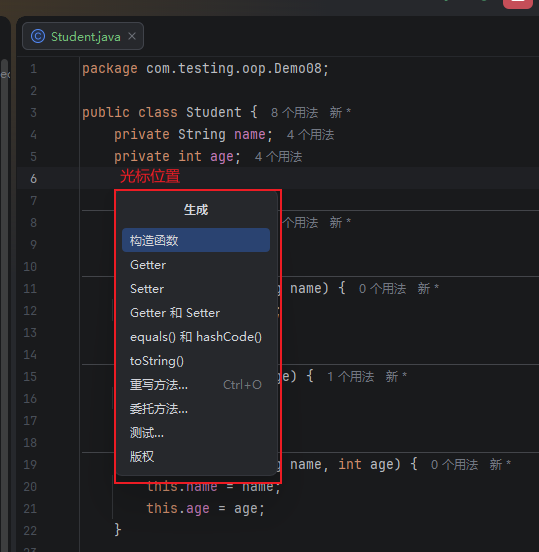

生成构造函数（如下图）：

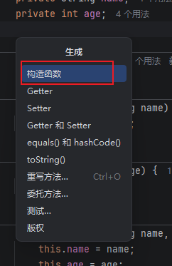

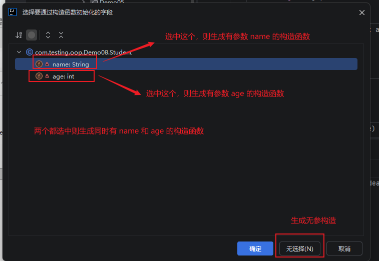

生成 get 和 set 方法（如下图）：

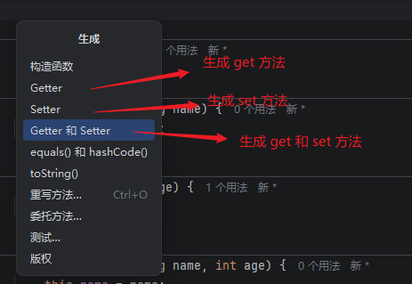

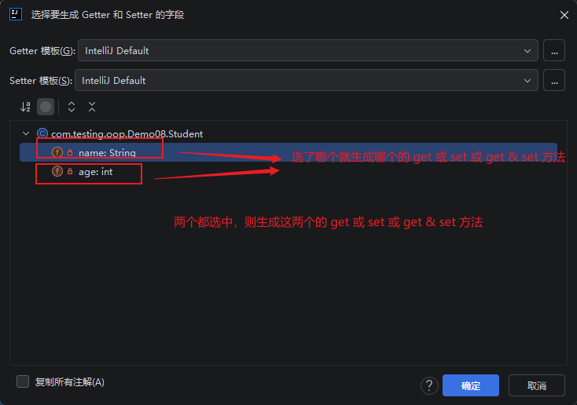

### JavaBean 在实际开发中的分层位置

`com.project.controller`，专门放和页面打交道的类（表现层）。
`com.project.service`，专门放业务处理的类（业务层）。
`com.project.dao`，专门放和数据打交道的类（持久层）。
`com.project.pojo`，专门放 JavaBean 类。
`com.project.utils`，专门放工具类。

### JavaBean 的使用

JavaBean 在实际开发中的使用，基本都和数据库的表相关联：

#### JavaBean 和数据库表的对应关系

- 类名 -> 表名
- 属性名 -> 列名
- 属性值 -> 表中单元格中的数据
- 对象 -> 表中每一行的数据

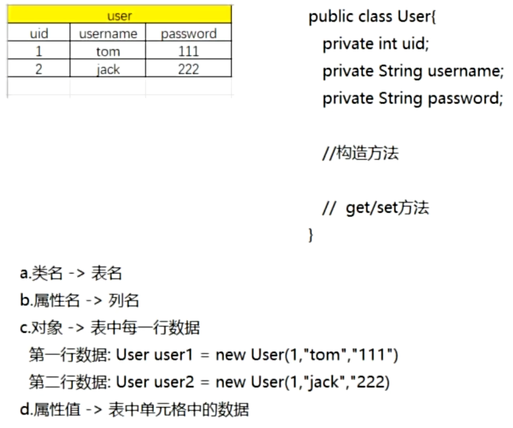

#### JavaBean 参与添加功能

此部分 JavaBean 表现出来的功能（添加）是，获取页面填写的数据，封装到 JavaBean 中，然后一层层传递到 dao 层（持久层），接着将 JavaBean 中的属性值取出来放到表中保存。这个过程就相当于一个**添加功能**。

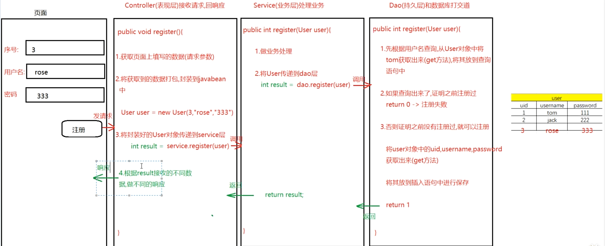

#### JavaBean 参与查询功能

此部分 JavaBean 表现出来的功能（查询）是，将所有的数据查询出来，封装成一个个 JavaBean 对象，然后将封装好的 JavaBean 对象放到一个容器中，再将此容器返回给页面，在页面上遍历展示。

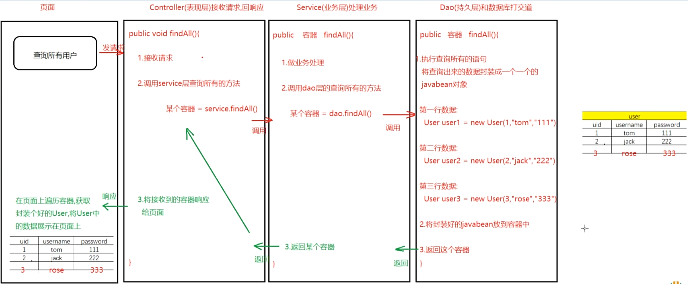

# 3 static 修饰符

`static` 是一个静态修饰符，用于修饰成员变量/方法，表示该成员属于类本身，而不属于某个实例对象，所有对象共享同一份，**可通过类名直接访问**，无需创建对象。

格式如下：

```java
// 修饰成员变量
static 数据类型 变量名

// 修饰成员方法
修饰符 static 返回值类型 方法名(形参) {
    方法体;
    return 结果;
}
```

静态成员的特点：

- 静态成员属于类成员，而不属于对象成员（非静态成员），可通过类名直接访问；
- 静态成员会随着类的加载而加载（类文件和其中信息存于方法区中），所以会优先于非静态成员存在于内存中；
- 基于相同类创建的对象，都可以共享静态成员。

```java
package com.testing.oop.Demo09;

public class Student {
    String name;
    int age;
    static String classRoom;

    public Student(String name, int age) {
        this.name = name;
        this.age = age;
    }
}
```

```java
package com.testing.oop.Demo09;

public class Demo09 {
    static void main() {
        Student.classRoom = "高三冲刺班";

        Student s1 = new Student("小韩", 200);
        System.out.println("第 1 个学生的名字：" + s1.name + "，年龄：" + s1.age + "，班级：" + Student.classRoom);

        Student s2 = new Student("大韩", 350);
        System.out.println("第 2 个学生的名字：" + s2.name + "，年龄：" + s2.age + "，班级：" + Student.classRoom);
    }
}

/*
第 1 个学生的名字：小韩，年龄：200，班级：高三冲刺班
第 2 个学生的名字：大韩，年龄：350，班级：高三冲刺班
*/
```

# 4
